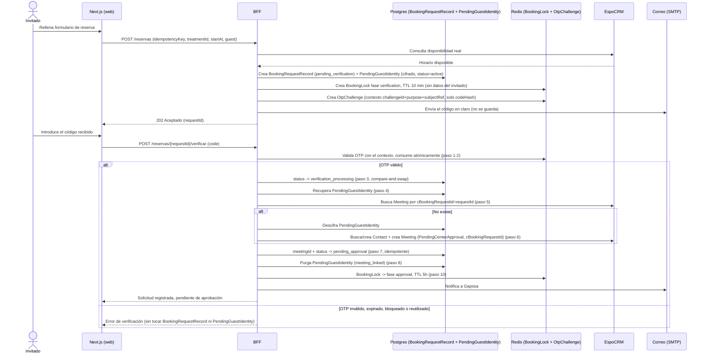

# Contratos técnicos del portal — Fase 0

Entregable de cierre de la Fase 0 (`PLAN_DESARROLLO_WEB_PORTAL.md` §17,
"Descubrimiento técnico y contratos"). Redactado el 5 de agosto de 2026.
**Revisión 4**, el mismo día. Corrige, sobre la revisión 3: la identidad
del invitado ya no puede perderse si Redis falla entre verificar el OTP y
crear el Contact/Meeting (nuevo `PendingGuestIdentity` cifrado y duradero
en Postgres); el orden exacto y atómico del flujo de verificación; una
política de auditoría verificable por dominio (no solo por tamaño); la
separación explícita entre evento de auditoría y nota operativa; un HMAC
de OTP contextualizado (ya no reutilizable entre retos); y una generación
de OTP sin sesgo de módulo. Ver §12 para el historial completo.
**Requiere aprobación explícita del propietario del proyecto antes de
iniciar integraciones críticas de Fase 3/4.** Complementa, no sustituye,
`PROJECT_CONTEXT.md` y `PLAN_DESARROLLO_WEB_PORTAL.md`: ante cualquier
contradicción, esos dos documentos mandan.

## 1. Monorepo y contratos de datos

- Workspace fijado con **npm workspaces**, sin Turborepo/pnpm de entrada.
- **`packages/contracts`** (`@gapssa/contracts`): tipos y funciones puras
  compartidas entre `apps/web` y el futuro BFF. Módulos: `estado-reserva.ts`,
  `booking.ts` (persistencia del ciclo de reserva y cancelaciones),
  `consent.ts` (cuestionarios y firma en dos etapas), `otp.ts` (OTP
  contextualizado), `inquiry.ts`, `idempotency.ts`, `audit.ts` (auditoría
  verificable).
- El paquete se ejecuta directamente como TypeScript con Node 24
  (`noEmit: true`, `allowImportingTsExtensions: true`, imports internos con
  extensión `.ts`), sin paso de build: es lo que permite
  `npm run test -w @gapssa/contracts` con el runner nativo de Node sin
  dependencias añadidas. **Pendiente de revisar en Fase 1** cuando
  `apps/web` (Next.js/webpack) necesite consumir el paquete compilado —
  puede requerir una estrategia de build distinta (ver §10).
- Verificación: `npm run typecheck -w @gapssa/contracts` (build +
  `tsconfig.test.json` sobre los `*.test.ts`) y `npm run test -w @gapssa/contracts`.
- No se han creado todavía `apps/web` ni `apps/cms`; este documento fija
  los contratos que esas apps deberán respetar.

## 2. Modelo real de EspoCRM auditado en Fase 0

Sin cambios respecto a la revisión 3. Auditoría hecha contra la instancia
en ejecución:

1. `CTratamiento.precioOrientativo`/`estadoPrecio` y
   `CZonaAtencion.capacidadSimultanea`/`suplementoDesplazamiento`: campos
   intencionados (precio orientativo mientras no existe FacturaScripts).
   Documentados en `docs/espocrm-modelo-inicial.md`.
2. `Meeting.status` nativo no podía representar los 12 estados de negocio
   → campo custom **`cEstadoReserva`** (enum, opcional, auditado, sin
   valor por defecto), ya desplegado. Mapeo en `estado-reserva.ts`; el
   hook que garantiza su sincronización con `status` está diseñado en §6
   (no implementado — Fase 4).

No existe todavía ningún API User en esta instancia. Esta revisión **no ha
modificado la instancia real de EspoCRM** ni la extensión Google Calendar
Sync.

## 3. Persistencia del ciclo de vida de la reserva

### 3.1 Tres piezas, no dos

Corrige la revisión 3: `BookingLock` en Redis era el único lugar donde
vivía `GuestContactInfo`. Si Redis fallaba o perdía la clave **entre
consumir el OTP y terminar de crear el Contact/Meeting**, el reintento no
tenía con quién completar la reserva, aunque `BookingRequestRecord`
hubiera sobrevivido en Postgres. Tipos en `packages/contracts/src/booking.ts`.

**A. `BookingRequestRecord` (Postgres, duradero).** Fuente de verdad del
**estado de la solicitud**. Sin datos personales del invitado. Igual que
en la revisión 3, salvo que `reason: string` pasó a
`reasonCode: BookingReasonCode | null` (`Approved`, `RejectedByStaff`,
`ApprovalExpired`, `VerificationExpired`, `RecoveryWindowExceeded`) — ver
§7 para el mismo razonamiento aplicado a `AuditEntry`.

**B. `PendingGuestIdentity` (Postgres, duradero, cifrado) — nuevo en esta
revisión.** Los datos de contacto del invitado mientras no existe todavía
un Contact/Meeting en EspoCRM. Relacionado 1:1 con `BookingRequestRecord`
por `bookingRequestId`.

| Campo | Tipo | Notas |
|---|---|---|
| `id` | string | |
| `bookingRequestId` | string | Relación 1:1 con `BookingRequestRecord.id` |
| `firstName`/`lastName`/`email`/`phone` | `EncryptedField` | Cifrados en la aplicación — nunca en texto plano |
| `emailLookupHmac` | string | HMAC-SHA-256 del correo normalizado con secreto de servidor — nunca el correo en claro |
| `status` | `active \| consumed \| discarded` | |
| `createdAt` | string (ISO) | |
| `expiresAt` | string (ISO) | = `BookingRequestRecord.verificationExpiresAt` en el momento de crearla |

`EncryptedField` (cifrado autenticado, p. ej. AES-256-GCM — **diseño de
contrato; el cifrado en sí es implementación de Fase 4, no de esta
revisión**):

```ts
interface EncryptedField {
  keyVersion: string; // versión del secreto de servidor que cifró — permite rotar la clave
  nonce: string;       // base64, único por cifrado
  ciphertext: string;  // base64, incluye el tag de autenticación
}
```

- La clave de cifrado se gestiona mediante un **secreto de servidor fuera
  del repositorio** (variable de entorno o gestor de secretos — mecanismo
  concreto a definir en Fase 1, igual que el resto de secretos del
  proyecto, `PROJECT_CONTEXT.md` §15.2).
- `emailLookupHmac` es el **único** mecanismo previsto para localizar
  límites por correo (`MAX_PENDING_REQUESTS_PER_CLIENT`, booking.ts) sin
  poder invertir el hash — no es un índice de búsqueda general y no
  sustituye el cifrado del campo `email`.
- **Nunca** aparece en índices legibles más allá de
  `id`/`bookingRequestId`/`emailLookupHmac`, en claves Redis, en
  `idempotencyKey` (que es un UUID sin relación con datos personales, ver
  §8.1) ni en `AuditEntry` — el actor de auditoría de un invitado usa
  `guestId` opaco (= `bookingRequestId`), nunca estos campos (§7).

**C. `BookingLock` (Redis, TTL).** Exclusión mutua. **Ya no lleva
`GuestContactInfo`** — solo datos de bloqueo (horario, fase, expiración).
Reconstruible desde A; nunca la única señal para una transición de negocio.

### 3.2 Fuentes de verdad por tipo de dato

| Dato | Fuente de verdad |
|---|---|
| Estado de la solicitud | `BookingRequestRecord.status`/`resolution` (Postgres) |
| Identidad del invitado antes de que exista Meeting | `PendingGuestIdentity` (Postgres, cifrado) — **nunca Redis, nunca en claro** |
| Estado del Meeting / contacto (una vez creado) | EspoCRM (`cEstadoReserva`/`status`, `Contact`) |
| Ocupación temporal del horario | `BookingLock` en Redis mientras no existe Meeting (única protección real); EspoCRM después |
| Historial y auditoría | `BookingRequestRecord` + log nativo de EspoCRM + `AuditEntry` del BFF — ninguno contiene PII del invitado |

### 3.3 Disparadores de purga de `PendingGuestIdentity`

Se purga (DELETE físico poco después de marcar el estado transicional —
nunca se retiene indefinidamente con `status` distinto de `active`) **solo**
en estos casos:

1. **`meeting_linked`** — se crea y vincula correctamente el Meeting
   (`meetingId` queda escrito en `BookingRequestRecord`): el Contact de
   EspoCRM ya es la fuente de verdad.
2. **`verification_expired`** — expira la verificación sin completarse.
3. **`request_canceled`** — se cancela la solicitud antes de completarse.
4. **`recovery_window_exceeded`** — el proceso queda abandonado más allá
   de `VERIFICATION_RECOVERY_WINDOW_MINUTES` (30 min, valor técnico
   sugerido).

`packages/contracts/src/booking.ts` expone
`decidePendingGuestIdentityPurgeTrigger(record, now, recoveryDeadline)`:
la parte **pura y comprobable** de esta decisión (sin tocar Postgres/
Redis/EspoCRM, que es responsabilidad del BFF en Fase 4). Cubre los
disparadores 1, 2 y 4 — el 3 (`request_canceled`) requiere una acción
explícita del cliente que todavía no tiene endpoint diseñado, así que la
función nunca lo infiere por sí sola. Cubierto por pruebas en
`booking.test.ts` (§11).

En ningún otro momento se borra: **un fallo de EspoCRM al crear el Meeting
no es motivo de purga** (§3.4, paso 8).

### 3.4 Flujo recuperable de verificación (orden exacto y atómico)

No es una transacción distribuida: es una secuencia de pasos idempotentes.
Ningún paso deja el OTP consumido sin que la identidad necesaria para
terminar la reserva siga existiendo en algún punto recuperable.

1. El invitado introduce el código. `otp.ts` valida el OTP contra el
   `OtpChallenge` (contexto `{challengeId, purpose, subjectRef}`, ver §5.1)
   **sin permitir reutilización**: si ya estaba `consumedAt` o `lockedAt`,
   se rechaza aquí y no se avanza ningún paso más.
2. Se marca el reto, **de forma atómica** (compare-and-swap sobre
   `consumedAt`/`attemptsUsed` en Redis), como consumido —o bloqueado, si
   se superó `maxAttempts`—. A partir de aquí el código ya no sirve para
   un segundo intento, se complete o no el resto del flujo.
3. `BookingRequestRecord` → `"verification_processing"` (compare-and-swap:
   solo si `status` seguía en `"pending_verification"`; si no, es un
   reintento → ir al paso 7).
4. Se recupera `PendingGuestIdentity` por `bookingRequestId` (Postgres,
   cifrado). Si no existe y el registro tampoco tiene `meetingId`
   todavía, es un estado inconsistente que solo puede venir de una purga
   prematura — lo trata la conciliación; **nunca se inventa un Contact con
   datos vacíos**.
5. Búsqueda idempotente en EspoCRM de un Meeting ya creado para este
   `requestId` (`cBookingRequestId`, mismo patrón que
   `GcsEventLink`/`espoMeetingId` de Google Calendar Sync). Si existe, se
   adopta.
6. Si no existe, se descifra `PendingGuestIdentity`, se busca o crea el
   Contact en EspoCRM (idempotente, reglas de coincidencia dudosa de
   `PROJECT_CONTEXT.md` §7.1 — diseño de Fase 4) y se crea el Meeting con
   `cEstadoReserva="PendingCenterApproval"` y `cBookingRequestId=requestId`.
7. Se escribe `meetingId` en `BookingRequestRecord` y se transiciona a
   `"pending_approval"` (idempotente).
8. **Solo después** de confirmar que `meetingId` quedó escrito en Postgres,
   se purga `PendingGuestIdentity` (`meeting_linked`). Si EspoCRM falla en
   el paso 6, o la escritura del paso 7 falla, `PendingGuestIdentity` **se
   conserva** para el próximo reintento.
9. Si se supera `VERIFICATION_RECOVERY_WINDOW_MINUTES` sin llegar al paso
   8, la conciliación resuelve `"verification_expired"`
   (`reasonCode = "RecoveryWindowExceeded"`) y purga `PendingGuestIdentity`.
10. Se activa/renueva el `BookingLock` en fase `approval`. Si falla, no es
    crítico: `approvalExpiresAt` ya quedó en Postgres.

**Casos cubiertos explícitamente:**

| Fallo | Resolución |
|---|---|
| OTP verificado y consumido, pero Redis falla antes de crear Contact/Meeting | `PendingGuestIdentity` sigue en Postgres (paso 4); el reintento retoma sin depender de Redis en absoluto |
| EspoCRM crea el Meeting pero falla la escritura en Postgres/Redis | El Meeting queda con `cBookingRequestId`; el reintento (paso 5) lo adopta. No se duplica |
| Se transiciona a `verification_processing` pero falla la creación en EspoCRM | El reintento repite los pasos 5-6. No se duplica |
| El cliente reintenta la verificación | El OTP ya está consumido (paso 1 lo rechaza como reutilización); si `meetingId` ya existe, se devuelve el resultado existente |



## 4. Solicitudes de cancelación — entidad `CSolicitudCancelacion`

Sin cambios de diseño respecto a la revisión 3 (campos, permisos, estados,
relaciones, recomendación provisional de caducidad). Ver revisión 3 para
el detalle completo; resumen:

- Entidad EspoCRM (no Postgres): Gapssa la revisa y decide desde la propia
  interfaz de EspoCRM. **No implementada todavía** (Fase 4).
- `estado` (`pending`/`approved`/`rejected`/`expired`/`canceled`), `motivo`
  (texto libre — nota operativa que vive en EspoCRM, ver §7.4), relación
  con `Meeting` y `Contact`, `idempotencyKey` con índice único.
- `CancellationRequest` en `booking.ts` sigue siendo el DTO de
  lectura/escritura del BFF sobre esa entidad — su campo `reason` mapea a
  `CSolicitudCancelacion.motivo`, no a un `AuditEntry`.

## 5. Verificación por OTP y firma de consentimiento

### 5.1 OTP contextualizado y sin sesgo

Dos correcciones sobre la revisión 3, en `packages/contracts/src/otp.ts`:

**HMAC contextualizado.** El HMAC firmaba solo el código: dos retos
distintos con el mismo código (plausible sobre 10⁶ combinaciones)
producían el mismo `codeHash`, así que un hash filtrado de un reto podía
reutilizarse para "verificar" otro. Ahora firma
`v1:<challengeId>:<purpose>:<subjectRef>:<code>` (serialización versionada,
sin correo/teléfono/IP):

```ts
hashOtpCode(context: { challengeId, purpose, subjectRef }, code, serverSecret): Promise<string>
verifyOtpCode(context, code, serverSecret, expectedHash): Promise<boolean>
```

Un código correcto con el contexto equivocado (otro `challengeId`,
`purpose` o `subjectRef`) **no verifica** — probado explícitamente en
`otp.test.ts` (§11). Comparación siempre en tiempo constante
(`constantTimeEqual`).

**Generación sin sesgo.** `generateOtpCode` ya no usa `Uint32 % 10`
(2³² no es múltiplo de 10, sesga los dígitos bajos). Usa **descarte por
rechazo**: se piden bytes aleatorios (`crypto.getRandomValues`, nunca
`Math.random`) y se descartan los valores ≥250 antes de tomar `% 10`, de
forma que cada dígito 0-9 tiene la misma probabilidad exacta. Las pruebas
verifican forma y funcionamiento (longitud, alfabeto, variedad entre
llamadas), **no** intentan demostrar uniformidad estadística con un test
frágil basado en umbrales de distribución.

El resto del diseño no cambia: `subjectRef` opaco, `maxAttempts`/bloqueo,
un solo uso, rate limiting por sujeto/IP/propósito
(`OTP_REQUEST_RATE_LIMIT`).

### 5.2 Firma en dos etapas

Sin cambios respecto a la revisión 3: `TemporarySignatureUpload` (temporal,
TTL, limpieza) → `ConsentSignature` (definitiva, solo tras OTP, con
`idempotencyKey` para recuperación si falla EspoCRM tras promover el
archivo). El contexto del OTP asociado (`otpChallengeId`) ahora también
implica que verificarlo usa `hashOtpCode`/`verifyOtpCode` con
`purpose: "consent_signature"` — mismo mecanismo que §5.1, sin cambios de
forma en `consent.ts`.

## 6. Mapeo `cEstadoReserva` → `Meeting.status` y hook de sincronización

Sin cambios de diseño respecto a la revisión 3 (tabla de mapeo, hook
`BeforeSave` en `Hooks/Meeting/SyncEstadoReservaToStatus.php`, no
implementado, pruebas de aceptación previstas, garantía de que un cambio
manual de `status` nunca inventa `cEstadoReserva`, detección de
inconsistencias en conciliación). Único ajuste terminológico: donde antes
se hablaba de "motivo técnico fijo" ahora es, consistentemente con §7,
`reasonCode = "ApprovalExpired"` en `BookingApprovalExpired`.

## 7. Auditoría segura y separación de notas operativas

### 7.1 Por qué la revisión 3 no bastaba

La revisión 3 limitaba el **tamaño** de `previousValue`/`newValue`/
`redactedValue`/`reason`. Eso no impedía guardar una contraseña corta, un
OTP, un token corto o una respuesta breve de cuestionario: todos caben
cómodamente por debajo de cualquier límite de longitud razonable. Un
límite de tamaño no es una política de contenido.

### 7.2 Política de dominio verificable (`packages/contracts/src/audit.ts`)

**A. Valores en crudo.** `RAW_VALUE_VALIDATORS` es un mapa
`Entity.field -> validador`, contra el enum real de ese campo — no una
regex ni un límite de longitud:

| `Entity.field` | Valida contra |
|---|---|
| `Meeting.cEstadoReserva` | `ESTADOS_RESERVA` (estado-reserva.ts) |
| `Meeting.status` | `ESTADOS_MEETING_NATIVOS` (estado-reserva.ts) |
| `CSolicitudCancelacion.estado` | `CANCELLATION_REQUEST_STATUSES` (booking.ts) |
| `BookingRequestRecord.status` | `BOOKING_REQUEST_STATUSES` (booking.ts) |
| `BookingRequestRecord.resolution` | `BOOKING_REQUEST_RESOLUTIONS` (booking.ts), o `null` |
| `BookingLock.phase` | `BOOKING_LOCK_PHASES` (booking.ts) |
| `PendingGuestIdentity.status` | `PENDING_GUEST_IDENTITY_STATUSES` (booking.ts) |

Cualquier valor que no pertenezca literalmente al enum se rechaza, **sea
cual sea su longitud** — un valor de dos caracteres tan corto como una
contraseña débil se rechaza exactamente igual que uno largo, porque la
comprobación es de pertenencia a un conjunto cerrado, no de tamaño.

**B. `redactedValue` estructurado.** Deja de ser texto libre:

```ts
interface RedactedValue {
  algorithm: "sha256" | "hmac-sha256";
  digest: string;    // 64 caracteres hexadecimales en minúsculas, formato validado
  changeKind: "signature_replaced" | "questionnaire_answered" | "document_uploaded"
            | "note_updated" | "credential_rotated"; // enum cerrado, nunca texto libre
}
```

Cualquier valor que no cumpla exactamente ese formato (otro tipo,
`digest` que no sea hex-64, `changeKind` fuera del enum) se rechaza.

**C. `reasonCode`, no `reason`.** `AuditEntry` ya no tiene un campo
`reason` de texto libre. Tiene `reasonCode?: AuditReasonCode`, un enum
cerrado (`ApprovedByStaff`, `RejectedByStaff`, `ApprovalExpired`,
`VerificationExpired`, `RecoveryWindowExceeded`, `ClientRequested`,
`SystemReconciliation`). **No se afirma que un algoritmo pueda detectar
todo secreto por heurística** — la solución no es una heurística mejor,
es no dejar hueco para texto libre en absoluto.

### 7.3 Construcción: sin atajos

`AuditEntry` lleva una marca nominal (símbolo real, no exportado) que solo
`createRawAuditEntry`, `createRedactedAuditEntry` y `validateAuditEntry`
pueden producir. Un objeto literal construido a mano en otro módulo no
satisface el tipo sin un `as AuditEntry` explícito — visible en revisión
de código, no un atajo accidental. **La capa de repositorio debe llamar
obligatoriamente a `validateAuditEntry` antes de insertar** cualquier
`AuditEntry` que no acabe de construirse en el mismo proceso (p. ej.
deserializado de una cola o reconstruido de Postgres): es la única forma
de obtener un valor con el tipo `AuditEntry` a partir de un `unknown`.

Pruebas negativas en `audit.test.ts` (§11): valores raw cortos pero
inválidos, `redactedValue` de texto libre, `changeKind`/`digest`/`reasonCode`
fuera de dominio, actor con forma desconocida.

### 7.4 `AuditEntry` frente a nota operativa — dos conceptos distintos

- **`AuditEntry`**: evento estructurado, sin contenido sensible ni texto
  libre innecesario. Vive donde decida el BFF (Postgres u otro almacén de
  auditoría — a definir en Fase 1), con su propia política de retención
  técnica.
- **Nota/motivo operativo**: dato de negocio (p. ej. el texto que Gapssa
  escribe al rechazar una solicitud), almacenado en el **sistema
  responsable** — EspoCRM —, con los permisos y la política de retención
  que ya aplican a esa entidad (`PROJECT_CONTEXT.md` §7.3, §10). No es un
  registro de auditoría técnica: es información operativa/de negocio, y
  potencialmente personal si menciona a alguien.

Un rechazo humano, por ejemplo, produce dos cosas separadas:

1. Un `AuditEntry` con `reasonCode = "RejectedByStaff"` (evento
   estructurado, sin la nota).
2. Si Gapssa quiso dejar una nota explicativa, esa nota vive en EspoCRM
   (p. ej. `CSolicitudCancelacion.motivo` o una nota en el propio
   `Meeting`) — visible solo a quien ya tiene permiso para ver esa
   entidad en EspoCRM (§4.3), nunca copiada dentro del log técnico de
   auditoría. La auditoría, como mucho, referencia que existe (por el
   propio `entityId` que ya apunta al registro), no su contenido.

Notas humanas **no se guardan en logs técnicos** (aplicación de
`PLAN_DESARROLLO_WEB_PORTAL.md` §15: "no registrar cuerpos de
cuestionarios, firmas, tokens o contraseñas en logs" se extiende aquí a
cualquier nota de texto libre potencialmente personal).

## 8. Idempotencia, errores y conciliación

### 8.1 Idempotencia
Sin cambios respecto a la revisión 3: `IdempotencyKey` es un UUID v4
generado por el cliente, sin datos personales; `payloadHash` es SHA-256
del payload canonicalizado; `checkIdempotency` distingue `new`/`duplicate`/
`conflict`.

### 8.2 Errores
Sin cambios: ninguna operación crítica se comunica como definitiva hasta
que EspoCRM confirma; fallos dejan la operación en `"failed_retryable"`,
nunca en limbo silencioso.

### 8.3 Conciliación diaria (actualizada)
Job programado que detecta, además de lo ya listado en revisiones
anteriores:

- `BookingRequestRecord` en `pending_verification`/`verification_processing`
  cuyo `verificationExpiresAt` (o `VERIFICATION_RECOVERY_WINDOW_MINUTES`
  desde que entró en `verification_processing`) venció →
  `verification_expired`, purga `PendingGuestIdentity`.
- `BookingRequestRecord` en `pending_approval` cuyo `approvalExpiresAt`
  venció → transición de §6 (`Canceled`, `reasonCode = "ApprovalExpired"`).
- `PendingGuestIdentity` en `active` cuyo `BookingRequestRecord` asociado
  ya no existe o ya está resuelto sin haberla purgado (job de limpieza
  dedicado, corre con más frecuencia que la conciliación diaria general —
  frecuencia exacta a definir en Fase 1, dado que estamos reteniendo PII
  cifrada y cuanto antes se purgue mejor).
- `BookingLock` que reconstruir en Redis a partir de `BookingRequestRecord`
  no resueltos.
- `Meeting` con `cEstadoReserva`/`status` inconsistentes (§6).
- `CSolicitudCancelacion` en `pending` sin decisión más allá de un plazo
  razonable (§4, no validado).

`BookingReconciliationReport.purgedGuestIdentities` desglosa las purgas
por disparador (`meeting_linked`/`verification_expired`/
`recovery_window_exceeded`/`request_canceled`) en cada pasada.

## 9. Plan de migraciones y reversión

- **Postgres**: además de `booking_request_record` (revisión 3), ahora
  incluye `pending_guest_identity` — columnas 1:1 con la tabla de §3.1
  (`first_name_ciphertext`/`_nonce`/`_key_version`, ídem
  `last_name`/`email`/`phone`, `email_lookup_hmac`, `status`, `created_at`,
  `expires_at`); índice único en `booking_request_id`, índice en `status`
  para que el job de limpieza no escanee toda la tabla, **sin índice
  sobre las columnas cifradas** (cifrar y luego indexar el texto plano
  derrotaría el propósito). Migraciones versionadas con el ORM/migrador
  que use Next.js/Payload (a fijar en Fase 1), cada una con su reversión
  probada.
- **Gestión de claves**: el secreto de cifrado de `PendingGuestIdentity` y
  el secreto HMAC de `otp.ts` viven fuera del repositorio (variable de
  entorno o gestor de secretos, mecanismo concreto a definir en Fase 1,
  igual que el resto de secretos del proyecto). `EncryptedField.keyVersion`
  permite rotar sin invalidar de golpe los datos ya cifrados.
- **Redis**: sin migraciones de esquema. Antes de Fase 4: prefijos de
  clave (`lock:`, `otp:`, `idempotency:`), política de persistencia
  (RDB/AOF), alcance de red en `compose.yml`.
- Antes de cualquier cambio de datos o de plataforma: copia recuperable y
  procedimiento de reversión documentado y probado. La copia de
  `pending_guest_identity` hereda la misma exigencia que cualquier tabla
  con PII cifrada: la copia también debe protegerse (cifrada en tránsito
  y en reposo), no solo la tabla en producción.

## 10. Pendiente explícito para Fase 1 (no resuelto en este documento)

- Estrategia de build de `packages/contracts` para cuando `apps/web`
  (Next.js/webpack) necesite consumirlo — hoy se ejecuta como TypeScript
  nativo con Node, sin paso de compilación.
- Mecanismo concreto de gestión de secretos (cifrado de
  `PendingGuestIdentity`, HMAC de OTP) — variable de entorno vs. gestor de
  secretos, procedimiento de rotación de `keyVersion`.
- Frecuencia del job de limpieza de `PendingGuestIdentity` (más frecuente
  que la conciliación diaria general, dado que retiene PII cifrada).
- Reglas concretas de coincidencia dudosa al buscar/crear `Contact` en el
  paso 6 del flujo de §3.4 (`PROJECT_CONTEXT.md` §7.1, aplicado a este
  flujo).
- Topología de red de `compose.yml` para Postgres/Redis; versión de
  Next.js; mecanismo de auth del API User de EspoCRM; mecanismo
  webhook-vs-polling para que el BFF se entere de decisiones tomadas en
  EspoCRM.
- Valores técnicos sugeridos a confirmar: `VERIFICATION_RECOVERY_WINDOW_MINUTES`,
  `OTP_DEFAULT_TTL_MINUTES`/`OTP_DEFAULT_MAX_ATTEMPTS`/`OTP_LOCKOUT_MINUTES`/
  `OTP_REQUEST_RATE_LIMIT`.
- Plazo de `CSolicitudCancelacion` pendiente (§4) — recomendación
  provisional, no validada.
- Runner de test para `apps/web` (Vitest o Jest) — distinto del runner
  nativo de Node usado en `packages/contracts`.
- **Verificado**: `docs/espocrm-modelo-inicial.md` documenta que 9
  `Meeting` de datos de prueba conservan `cEstadoReserva = "RequestReceived"`
  por el `default` retirado en la revisión 2 — no se han reescrito.

## 11. Verificación ejecutada en esta revisión

- `npm run typecheck -w @gapssa/contracts` → limpio (build +
  `tsconfig.test.json`).
- `npm run test -w @gapssa/contracts` → **45/45 tests en verde** (Node
  `--test` nativo). Desglose:
  - `audit.test.ts` (17 casos): valores raw válidos/rechazados por
    dominio (incluidos casos cortos pero inválidos), `redactedValue`
    estructurado válido/rechazado, `reasonCode` válido/inválido, actor con
    forma desconocida.
  - `booking.test.ts` (7 casos, nuevo): `decidePendingGuestIdentityPurgeTrigger`
    en sus cuatro combinaciones relevantes (activo dentro de ventana,
    `meeting_linked`, `verification_expired`, `recovery_window_exceeded`,
    precedencia de `meeting_linked`), y verificación en tiempo de
    compilación de que `BookingLock` ya no admite `guest`.
  - `idempotency.test.ts` (8 casos): sin cambios respecto a revisiones
    anteriores.
  - `otp.test.ts` (13 casos): generación uniforme (forma, no
    estadística), HMAC contextualizado (mismo código con distinto
    `challengeId`/`purpose`/`subjectRef` produce hashes distintos; un
    hash de un reto no verifica en otro), comparación en tiempo
    constante.
- No se ha tocado la instancia real de EspoCRM ni la extensión Google
  Calendar Sync: no aplica `make gcs-test` ni un nuevo `app-check`.
- Revisión de consistencia: sin referencias residuales a `reason: string`
  libre en `AuditEntry`/`BookingRequestRecord`, sin `guest` en
  `BookingLock`, sin `Uint32 % 10` en `otp.ts`.

## 12. Historial de revisiones

- **Revisión 1**: alta de `cEstadoReserva`, contratos iniciales.
- **Revisión 2**: momento de creación del Meeting (verificación, no
  aprobación), solicitudes de cancelación separadas del Meeting, retirada
  de `verificationCode`/`signatureDataUrl` del contrato de firma,
  idempotencia por UUID+hash, sin `default` en `cEstadoReserva`, tabla de
  mapeo con `status`, primera política de auditoría.
- **Revisión 3**: persistencia duradera de solicitudes/holds (dos capas),
  flujo recuperable de verificación, diseño del hook de EspoCRM
  `cEstadoReserva`→`status`, API de auditoría con validación en ejecución,
  OTP con HMAC/rate limiting, firma en dos etapas, diseño de
  `CSolicitudCancelacion`.
- **Revisión 4** (esta): `PendingGuestIdentity` cifrada y duradera en
  Postgres (tercera pieza de persistencia, ya no solo dos), orden exacto y
  atómico del flujo de verificación con recuperación de identidad, política
  de auditoría por dominio verificable (`RAW_VALUE_VALIDATORS`,
  `RedactedValue` estructurado, `reasonCode` cerrado), separación explícita
  entre `AuditEntry` y nota operativa, HMAC de OTP contextualizado
  (`challengeId`+`purpose`+`subjectRef`), generación de OTP sin sesgo de
  módulo (rejection sampling).

## 13. Aprobación

Este documento debe aprobarse explícitamente antes de iniciar Fase 3
(autenticación/portal base) y Fase 4 (reservas, cancelaciones,
consentimientos, hook de sincronización, cifrado de `PendingGuestIdentity`),
que son las que ejecutan estos contratos contra EspoCRM real. Fase 1 (base
de plataforma) puede avanzar en paralelo a la revisión, ya que no ejecuta
lógica de negocio todavía.
