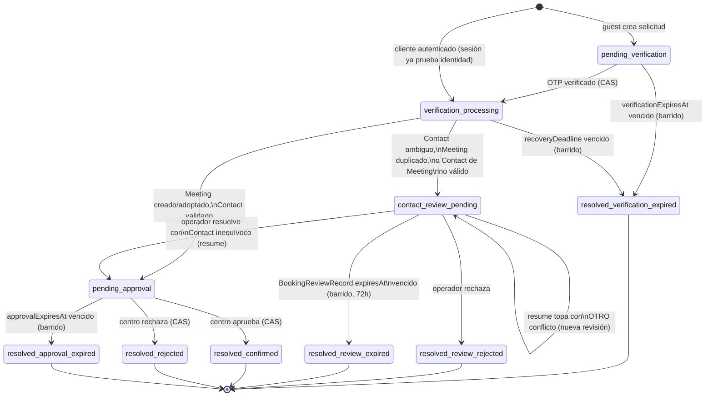
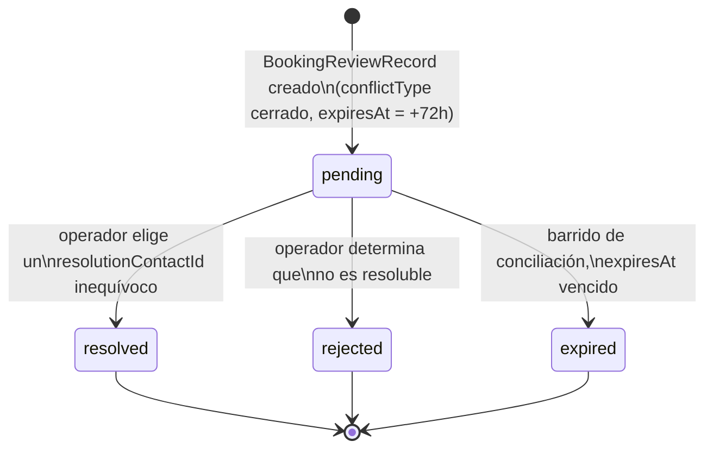

# Fase 4B — Preparación de la integración HTTP real de reservas con EspoCRM

Entregable de Fase 4B (auditoría real de solo lectura, decisiones técnicas,
adaptador HTTP, idempotencia, matching de Contact, hook de sincronización,
pruebas contractuales). Redactado el 10 de agosto de 2026, tras la
aprobación explícita de Fase 4A (incluida la revisión 3). **No se ha
escrito ningún registro nuevo en la instancia real de EspoCRM. No se ha
desplegado el hook PHP en el contenedor real. No se ha creado ningún API
User real. No se ha hecho ningún commit.** Complementa, no sustituye,
`docs/fase4a-reservas.md`, `docs/fase4a-revision-3.md` y
`docs/contratos-portal-v1.md`.

## 1. Auditoría real de EspoCRM (solo lectura)

Ejecutada contra la instancia real en ejecución (`localhost:8081`,
contenedores `espocrm`/`espocrm-db`/`espocrm-daemon`/`espocrm-websocket`,
todos sanos). Sin escrituras: solo `GET` autenticados y una consulta
`SELECT` de comparación de hashes (nunca de valores) contra MariaDB.

- **Versión**: EspoCRM **10.0.3** — coincide con `docs/espocrm-modelo-inicial.md`.
- **Usuarios**: exactamente 2 — `admin` (`type: admin`) y una usuaria
  `regular` con el rol "Profesional Gapssa". **Ningún API User existe
  todavía** — confirma lo ya documentado en Fase 0/3. Ambas cuentas con
  `authMethod: null` (password estándar EspoCRM), sin API Key ni HMAC
  configurados hoy.
- **Rol "Profesional Gapssa"**: `Meeting`/`Contact`/`Account` con
  create/edit/read "all"; `CTratamiento`/`CZonaAtencion` **de solo
  lectura** para ese rol (`create/edit/delete: no`) — referencia útil de
  "permisos mínimos" para el futuro API User.
- **`Meeting.cEstadoReserva`**: desplegado exactamente como documentado
  (enum, 12 valores, opcional, sin default). **`Meeting.cBookingRequestId`
  NO existe todavía** — confirmado también por inspección directa de
  `extensions/espocrm/custom/.../metadata/entityDefs/Meeting.json`.
- **`Contact`**: 46 campos, todos nativos de EspoCRM. **`gapssaAccountId`
  NO existe** — pendiente desde Fase 3 (`docs/fase3-autenticacion.md`
  §6.1), confirmado hoy contra la instancia real.
- **`CTratamiento`/`CZonaAtencion`**: campos documentados presentes
  (`familia`, `duracionMinutos`, `precioOrientativo`, `estadoPrecio`,
  `capacidadSimultanea`...). Datos de prueba `[PRUEBA]` intactos.
- **7 `Meeting`** de prueba (no 9 — al menos 2 se depuraron desde agosto),
  todos con `cEstadoReserva=RequestReceived`, ninguno pasó por el portal.
- **Índices reales**: `GcsEventLink` (extensión Google Calendar Sync) usa
  un índice único compuesto declarado en `entityDefs` (`"indexes":
  {"meetingAccount": {"unique": true, "columns": ["meetingId",
  "accountId"]}}`) — referencia exacta de cómo se declararía, cuando se
  autorice, el índice único recomendado sobre `cBookingRequestId`.
- **`Webhook`**: entidad nativa disponible, 0 configurados — nunca usada
  todavía.
- **`GcsAccount`**: 1 cuenta ("Calendario Business"), `status: Active` —
  extensión Google Calendar Sync operativa, sin relación directa con esta
  fase.
- **Solapes de Meetings**: se consultan vía `GET /api/v1/Meeting` con
  `where[]` (`notIn`/`lessThan`/`greaterThan`/`equals`) — sintaxis
  verificada, implementada en `httpEspoAdapter.ts`.
- **Red**: `apps/web` corre con `next dev` **en el host**, no en
  contenedor (confirmado en `compose.yml`) — el adaptador HTTP apunta a
  `http://localhost:8081` en desarrollo, nunca al hostname interno de
  Docker `espocrm`.

### Discrepancia operativa encontrada (bloqueante para la auditoría, no de código)

El `.env` de la raíz tenía credenciales de EspoCRM (usuario admin,
contraseña de MariaDB) que **no coincidían** con las que los contenedores
en ejecución tenían realmente cargadas (confirmado comparando hashes
SHA-256, nunca los valores). Se completó la auditoría usando las
credenciales reales tomadas del entorno del propio contenedor
(`docker compose exec espocrm printenv ...`); no se escribieron en ningún
archivo. **Recomendación**: sincronizar `.env` con lo que los contenedores
tienen realmente cargado antes de que alguien más lo use asumiendo que
`.env` es correcto — fuera del alcance de esta fase corregirlo por cuenta
propia.

### Incidente durante la auditoría

Una consulta intermedia sin filtrar campos (`GET /User`) devolvió, y se
imprimió por error en la conversación con el propietario, el nombre,
correo y teléfono reales de la profesional dada de alta en el CRM. No
quedó guardado en ningún archivo del repositorio ni de scratchpad
(fichero temporal borrado); solo apareció en el historial de esa
conversación. Se corrigió el método (consultas con `select=` explícito)
para el resto de la auditoría. Reportado al propietario en el momento.

## 2. Discrepancias encontradas frente a los documentos existentes

| Documento/diseño | Discrepancia con la instancia real |
|---|---|
| `docs/fase3-autenticacion.md` §6.1, `espoAdapter.ts` (`SimContact.gapssaAccountId`) | `Contact.gapssaAccountId` no existe en EspoCRM real — el matching por cuenta Gapssa no puede funcionar contra la instancia real hasta que se cree ese campo custom (escritura de esquema, requiere autorización aparte, ver §10) |
| `docs/contratos-portal-v1.md` §3.4 paso 5, `booking.ts` (`MEETING_BOOKING_REQUEST_FIELD`) | `Meeting.cBookingRequestId` no existe todavía — esperado, ya documentado como pendiente; confirmado hoy |
| `docs/contratos-portal-v1.md` §6, "hook `BeforeSave` en `Hooks/Meeting/SyncEstadoReservaToStatus.php`" | La instancia real ya usa el patrón moderno de EspoCRM 10 (`Espo\Custom\Classes\RecordHooks\Meeting\*` + `recordDefs/Meeting.json`, `beforeCreateHookClassNameList`/`beforeUpdateHookClassNameList`), no el hook clásico `Hooks/{Entity}/{Clase}` que asumía el documento original (escrito antes de que existiera ningún hook real aquí). El hook de esta fase sigue el patrón real ya en uso — ver §8 |
| `SimMeeting.decidedBy`/`decidedAt` (`espoAdapter.ts`) | Sin campo real equivalente en EspoCRM — el adaptador HTTP aproxima con los nativos `modifiedById`/`modifiedAt` (impreciso si alguien edita el Meeting por otro motivo después de decidirlo); `note` sí tiene equivalente real exacto (`description`) |
| `Meeting.optimisticConcurrencyControl` (metadata real) | Está **desactivado** — el adaptador simulado aplica CAS real vía `WHERE cEstadoReserva = ...` en Postgres; la API REST de EspoCRM no ofrece un PUT condicional equivalente (ver §7 de la arquitectura del adaptador, más abajo) |
| `Meeting.contacts` (linkMultiple, real) vs. `SimMeeting.contactId` (contrato, singular) | EspoCRM modela Meeting↔Contact como muchos-a-muchos; el contrato asume uno. El adaptador HTTP siempre crea/relaciona exactamente un Contact, pero al leer un Meeting ajeno al portal con 0 o >1 contactos relacionados, toma el primero — simplificación deliberada y documentada, no un fallo |

## 3. Recomendación de autenticación BFF↔EspoCRM

**API Key** (`X-Api-Key`), no HMAC ni OAuth — **confirmado por el
propietario**. Un API User dedicado (nunca `admin` ni la cuenta humana
existente), con permisos mínimos calcados del rol "Profesional Gapssa"
(lectura de catálogo, lectura/escritura de `Meeting`/`Contact`, sin panel
de administración). Rotación: mismo patrón de versionado que
`BOOKING_FIELD_ENCRYPTION_KEYS` (Fase 4A) — variables de entorno
independientes por entorno (`ESPOCRM_API_KEY` en dev/staging/producción,
nunca compartida). **Creación real del API User: pendiente de tu
autorización aparte (§10) — no se ha creado hoy.**

## 4. Recomendación webhook/polling (EspoCRM→BFF)

**Híbrida: webhook nativo de EspoCRM (`Meeting` `AfterSave`/`AfterUpdate`)
como vía primaria + el barrido de conciliación ya existente
(`/internal/sweep`) como red de seguridad** — mismo patrón que
`GcsPushSweep` de la extensión Google Calendar Sync (los jobs/webhooks
fallidos no se reintentan solos). Diseño completo, sin desplegar, en §7
(§9 del encargo original).

## 5. Política de coincidencia de Contact — implementada

Prioridad `gapssaAccountId` → correo → teléfono → cero=crear →
una=reutilizar → varias/contradictorias=revisión manual. **Nunca se
fusiona.** Extensión mínima del contrato, **aprobada explícitamente**
antes de implementarla:

1. `EspoBookingAdapter.findOrCreateContact` (`espoAdapter.ts`) devuelve
   ahora `ContactMatchResult`: `{outcome: 'matched'|'created', contact}` o
   `{outcome: 'manual_review', candidateContactIds}`.
2. `BookingRequestStatus` (`packages/contracts/src/booking.ts`) gana
   `"contact_review_pending"` — se entra desde `verification_processing`
   cuando el matching es ambiguo; el Meeting nunca se crea;
   `PendingGuestIdentity` **nunca se purga** desde ahí (no es un
   disparador de purga, mismo principio que un fallo transitorio de
   EspoCRM).
3. `AuditReasonCode` (`packages/contracts/src/audit.ts`) gana
   `"ContactAmbiguous"`.

`SimulatedEspoBookingAdapter` y `HttpEspoBookingAdapter` implementan
ambos la misma política (correo y teléfono apuntando a Contacts
*distintos* → `manual_review`; una coincidencia exacta → `matched`; cero →
`created`) — verificado con pruebas equivalentes contra ambos adaptadores
(§9).

**Limitación conocida, no resuelta hoy**: `contact_review_pending` es, en
esta fase, un estado sin reintento automático — ni el barrido de
conciliación ni ningún endpoint lo retoma todavía (a diferencia de
`verification_processing`/`pending_approval`, que sí tienen mecanismos de
recuperación ya construidos). Retomarlo hoy exigiría, para el flujo de
invitado, un paso de barrido nuevo (viable: `PendingGuestIdentity` se
conserva) y, para el flujo autenticado, no hay ningún dato durable con el
que reintentar (los datos de contacto no persisten fuera de la propia
petición) — **decisión pendiente, marcada explícitamente, no resuelta por
mi cuenta**: ¿se construye un panel/proceso de resolución manual, un
reintento automático solo para invitados, o se deja para una fase
posterior?

## 6. Arquitectura del adaptador HTTP

`HttpEspoBookingAdapter` (`apps/web/src/server/booking/httpEspoAdapter.ts`)
implementa `EspoBookingAdapter` exactamente — ningún llamante
(`guestFlow.ts`, `authenticatedFlow.ts`, `verificationSteps.ts`,
`reconciliation.ts`, `decisionRecovery.ts`) cambió su forma de llamar al
adaptador.

- **Cliente HTTP server-only** (`import 'server-only'`), `fetch` nativo.
- **Selector explícito** (`adapterSelector.ts::getEspoBookingAdapter`) —
  único punto de instanciación; los 7 endpoints de
  `app/api/booking/v1/**` y `decisionRecovery.ts` pasaron a usarlo (antes
  instanciaban `SimulatedEspoBookingAdapter` directamente).
  `ESPO_BOOKING_ADAPTER` (`server/env.ts`) por defecto **`simulated`** —
  `http` sin `ESPOCRM_API_BASE_URL`/`ESPOCRM_API_KEY`/
  `ESPOCRM_PROFESSIONAL_USER_IDS` completos **falla el arranque del
  proceso** (verificado con pruebas, `env.test.ts`), nunca cae de vuelta
  al simulado en silencio.
- **Timeouts + `AbortController`** (`ESPOCRM_API_TIMEOUT_MS`, defecto
  8000ms).
- **Reintentos solo para `GET`** (operaciones idempotentes por
  construcción), backoff exponencial limitado
  (`ESPOCRM_API_RETRY_BASE_DELAY_MS`, `ESPOCRM_API_MAX_RETRIES`). Ningún
  `POST`/`PUT` se reintenta automáticamente.
- **Redacción completa**: `Authorization`/`X-Api-Key` nunca aparecen en
  ningún mensaje de error; el cuerpo de la petición (puede llevar PII de
  Contact) tampoco. Verificado con pruebas dedicadas (§9).
- **Correlation id opaco** (`randomUUID()` por petición) — solo para
  correlar los propios logs de error de este adaptador; EspoCRM no lo
  interpreta.
- **Respuestas runtime-validadas** con `zod` — nunca se confía solo en
  TypeScript sobre lo que devuelve la red.
- **Paginación**: `listAllPages` recorre `offset`/`maxSize` hasta agotar
  `total` o un tope de seguridad (protección contra catálogos
  inesperadamente grandes).
- **Protección contra respuestas grandes**: lectura del body con tope de
  bytes (`ESPOCRM_API_MAX_RESPONSE_BYTES`) antes de intentar `JSON.parse`.
- **Sin circuit breaker**: decisión deliberada, no una omisión — un solo
  centro, bajo volumen, los timeouts+backoff ya acotan el impacto de un
  EspoCRM caído; un circuit breaker sin tráfico suficiente para calibrarlo
  sería complejidad no probada.
- **"Profesional reservable"**: EspoCRM no tiene ningún campo/rol que lo
  marque — se usa `ESPOCRM_PROFESSIONAL_USER_IDS` (lista blanca explícita
  de `User.id`, variable de entorno), en vez de inventar un criterio de
  rol/equipo no confirmado.

### Limitación real, documentada (no resuelta): decisión/expiración sin OCC real

`Meeting.optimisticConcurrencyControl` está desactivado en EspoCRM real.
`decideMeeting`/`expireMeeting` hacen lectura-antes-de-escribir con
comprobación en el cliente (`writeIfPendingCenterApproval`): lee, escribe
solo si seguía `PendingCenterApproval`, **relee** y descarta el resultado
si el estado final no coincide con lo esperado. Esto reduce la ventana de
carrera pero **no es un CAS atómico de verdad** — dos decisiones casi
simultáneas contra la instancia real tienen una ventana de carrera
genuina que Postgres (adaptador simulado) no tiene. La mitigación
estructural sería el hook `BeforeSave`/`RecordHook` (§8) validando la
transición dentro del propio guardado de EspoCRM — no implementado como
tal en esta fase (el hook de esta fase solo sincroniza `status`, no
valida transiciones de `cEstadoReserva`).

## 7. Mecanismo EspoCRM→BFF de decisiones — diseño, NO desplegado

Payload cerrado:

```ts
interface EspoDecisionWebhookPayload {
  eventId: string;         // UUID — idempotencia
  meetingId: string;
  bookingRequestId: string; // = cBookingRequestId
  decision: 'approved' | 'rejected';
  decidedAt: string;        // ISO 8601
  signature: string;        // HMAC-SHA256 sobre el resto, canonicalizado
}
```

- **Emisión**: un `RecordHook` `afterUpdate` en `Meeting` (mismo patrón
  que §8) detecta `cEstadoReserva` pasando de `PendingCenterApproval` a
  `Confirmed`/`Canceled` **por una decisión humana** (nunca por el propio
  BFF adoptando un Meeting, ni por la expiración de sistema) y hace un
  `POST` al BFF con el payload firmado.
- **Firma/autenticación**: HMAC-SHA256 sobre el payload canonicalizado
  (mismo patrón que `hmacSubjectId`/`hashOtpCode`, ya usados en el
  proyecto), secreto compartido dedicado
  (`ESPOCRM_DECISION_WEBHOOK_HMAC_SECRET`, nunca el mismo que
  `ESPOCRM_API_KEY` — direcciones distintas). Cabecera
  `X-Espo-Decision-Signature`.
- **Anti-replay**: ventana de tolerancia sobre `decidedAt` (p. ej. 5 min);
  payloads más antiguos se rechazan.
- **Idempotencia por `eventId`**: tabla dedicada (o reutilización del
  patrón de `booking_outbox_jobs`) que registra `eventId` ya procesados —
  un reintento de red del propio EspoCRM, o un replay, responde 200 sin
  reprocesar.
- **Validación contra el Meeting real**: el BFF nunca aplica el payload a
  ciegas — confirma con `adapter.getMeetingById(meetingId)` que
  `cEstadoReserva` real coincide con `decision` antes de tocar nada.
- **Reconciliación webhook vs. consulta**: reutiliza
  `applyOrAdoptBookingDecision`/`decisionRecovery.ts` tal cual — la rama
  "adaptador real futuro" ya escrita en Fase 4A (revisión 2) es
  exactamente el algoritmo correcto aquí sin cambios: nunca sobrescribe
  una resolución incompatible ya asentada, deja `SystemReconciliation`
  para revisión.
- **Polling de seguridad**: sí, recomendado — `/internal/sweep` ya
  reconcilia `pending_approval` contra el Meeting real cuando el CAS no
  gana (`sweepExpiredApprovals`). No hace falta un mecanismo nuevo, solo
  el cron real ya pendiente desde Fase 4A §9.
- **Separación de endpoints**: `/internal/decisions` (secreto compartido
  `X-Internal-Api-Secret`) sigue siendo la vía manual/interna; el futuro
  webhook real viviría en una ruta **nueva** (`/internal/espocrm-decision`
  o similar), con su **propia** autenticación HMAC — nunca comparte ruta
  ni secreto con la vía manual.

Nada de esto se ha implementado (ninguna ruta nueva, ningún hook
`afterUpdate` nuevo en EspoCRM) — **diseño explícitamente pendiente de tu
aprobación antes de construirlo**.

## 8. Hook `cEstadoReserva` → `status` — preparado, NO desplegado

`extensions/espocrm/custom/Espo/Custom/Classes/RecordHooks/Meeting/SyncEstadoReservaToStatus.php`
(nuevo) + registro en
`extensions/espocrm/custom/Espo/Custom/Resources/metadata/recordDefs/Meeting.json`
(`beforeCreateHookClassNameList`/`beforeUpdateHookClassNameList`).

- Sigue el patrón **real** ya usado en esta instancia
  (`Classes/RecordHooks/Meeting/SendInvitationsAfterCreate`/`...AfterUpdate`,
  ya exportados), no el hook clásico que asumía el diseño original de
  `docs/contratos-portal-v1.md` §6 — discrepancia documentada en §2.
- Tabla de mapeo completa, idéntica a
  `ESTADO_RESERVA_A_MEETING_STATUS` (`packages/contracts/src/estado-reserva.ts`).
- Dirección única `cEstadoReserva → status`: nunca lee `status` para
  decidir nada — un cambio manual de `status` nativo nunca inventa
  `cEstadoReserva`.
- `cEstadoReserva` ausente/null (reuniones internas, importadas de
  Google) → nunca toca `status`.
- Solo actúa si `cEstadoReserva` es nuevo o cambió
  (`isAttributeChanged`).
- **Sin bucles**: al ser un hook "before" (muta la entidad antes de
  persistir), no dispara un nuevo ciclo de guardado — a diferencia de un
  `afterSave` que llamara a `save()` de nuevo.
- **Compatible con Google Calendar Sync**: `GcsPush` es un hook
  `AfterSave` clásico, corre DESPUÉS de que este hook `before` ya dejó
  `status` sincronizado y DESPUÉS de persistir — siempre ve el `status`
  final correcto.
- **Verificado**: `php -l` contra el PHP real del contenedor
  (`docker compose exec espocrm php -l ...`) — sin errores de sintaxis.
  **No se ha copiado al volumen del contenedor ni ejecutado
  `bin/command rebuild`** — `extensions/espocrm/custom` es, hoy, solo un
  destino de exportación (`make espocrm-export` copia DESDE el contenedor
  HACIA aquí, nunca al revés — `Makefile`), así que este cambio en el
  repositorio no tiene ninguna conexión activa con la instancia real;
  desplegarlo requeriría un paso manual explícito, no realizado.
- **Pruebas unitarias PHP**: no existe arnés de pruebas PHP para
  `extensions/espocrm/custom` (a diferencia de la extensión Google
  Calendar Sync, que sí tiene `composer.json`/`make gcs-test`) — construir
  uno desde cero para una sola clase habría sido una inversión de
  infraestructura desproporcionada para esta fase. Cubierto en su lugar
  con `php -l` (sintaxis) y con que la tabla de mapeo es una copia literal
  ya cubierta por pruebas TypeScript (`estado-reserva.ts`).

## 9. Pruebas y resultados exactos

- **`src/server/booking/httpEspoAdapter.test.ts`** (nuevo, unitarias,
  contra `FakeEspoServer` — `tests/contract/fakeEspoServer.ts`, servidor
  HTTP en memoria, puerto efímero 127.0.0.1, nunca la instancia real):
  **24/24** — autenticación correcta/rechazada, timeout con reintentos
  agotados, 404→`null`, 500 no retryable, 429 con reintento y con
  reintentos agotados, un `POST` nunca se reintenta automáticamente,
  JSON inválido, paginación, protección contra respuestas grandes,
  búsqueda sin Meeting / con Meeting único / con duplicados por
  `cBookingRequestId`, creación idempotente (nueva / timeout-y-adopción /
  dos creaciones concurrentes con índice único simulado en el fake),
  matching de Contact (cero/una/ambiguo), decisión con CAS-por-relectura
  (aprobar / decidir ya decidido), ausencia de API key/PII en errores,
  ningún acceso fuera de 127.0.0.1.
- **`tests/integration/booking.simulatedEspoAdapter.contract.int.test.ts`**
  (nuevo, mismos escenarios de matching/idempotencia/CAS contra
  `SimulatedEspoBookingAdapter` y `gapssa_booking_test_<random>` efímera —
  nunca `gapssa_booking` real): **10/10** — demuestra comportamiento
  equivalente al adaptador HTTP en los puntos exigidos por el contrato.
- **`src/server/env.test.ts`** (extendido): **+7 pruebas** —
  `ESPO_BOOKING_ADAPTER` por defecto `simulated`; valores por defecto del
  adaptador HTTP; `http` sin configuración completa falla el arranque
  (probado con las 4 combinaciones incompletas); `http` con configuración
  completa se acepta; `ESPOCRM_API_BASE_URL` inválido se rechaza siempre;
  `ESPO_BOOKING_ADAPTER` con un valor desconocido se rechaza.
- **`npm run test -w @gapssa/web`**: **673/673** (33 ficheros).
- **`npm run test -w @gapssa/contracts`**: **95/95** (sin cambios de
  comportamiento — solo 2 valores nuevos en enums cerrados).
- **`npm run test:integration`** (raíz): **223/223** (23 ficheros) — los
  208 de Fase 4A/revisión 3 siguen en verde sin cambios de comportamiento,
  más los 10 nuevos de este contract test y 5 más de cobertura ya
  existente que ejercitan indirectamente los cambios de
  `verificationSteps.ts`/`repository.ts` (`writeMeetingIdAndPendingApproval`
  ahora audita el `previousValue` real en vez de un literal fijo).
- **`npm run typecheck`** (raíz, todos los workspaces): limpio.
- **`npm run lint`**: limpio, 0 errores/avisos.
- **`npm run build`**: compila limpio, todas las rutas en el manifiesto
  (incluidas las de `booking/v1`).
- **`npx playwright test`**: **43/43**, sin cambios de comportamiento
  visible (el selector de adaptador es transparente para la UI).
- **`docker compose config`**: válido.
- **`/api/health`**: `{"status":"ok"}` (`app`/`postgresCms`/`redis`).
  **`/api/health/live`**: `{"status":"ok"}`.
- **Ningún acceso accidental a EspoCRM real durante las suites**:
  verificado (a) por inspección — ninguna suite define
  `ESPO_BOOKING_ADAPTER=http` en su entorno, el default `simulated`
  cubre unitarias/integración/e2e; (b) arrancando `next dev` localmente y
  confirmando que su log no contiene ninguna referencia a EspoCRM/puerto
  8081 tras ejercitar `/api/health`.

## 10. Escrituras reales pendientes de tu autorización expresa

Nada de esto se ha hecho. Lista concreta para cuando decidas autorizarlo,
por separado y explícitamente:

| # | Escritura | Endpoint/mecanismo | Entidad y campos | Permisos requeridos | Datos ficticios a crear | Limpieza | Riesgos | Reversión |
|---|---|---|---|---|---|---|---|---|
| 1 | Crear el campo custom `Contact.gapssaAccountId` | Studio de EspoCRM (UI), o `bin/command rebuild` tras editar metadata | `Contact` — nuevo campo `varchar` | Admin | Ninguno (alta de esquema, no de datos) | N/A | Bajo — campo opcional, no rompe nada existente | Eliminar el campo desde Studio |
| 2 | Crear el campo custom `Meeting.cBookingRequestId` + índice único | Studio de EspoCRM (UI) | `Meeting` — nuevo campo `varchar`, índice único | Admin | Ninguno | N/A | Bajo si se hace antes de tener datos con el campo repetido; medio si ya hay Meetings de prueba sin él (backfill nulo, único ignora nulos en MySQL — a confirmar) | Eliminar campo/índice desde Studio |
| 3 | Crear el API User dedicado + generar su API Key | UI de EspoCRM (Administración → Usuarios) | `User` (`type: api`) | Admin | Un usuario técnico, sin PII real | Desactivar/eliminar el usuario | Bajo — aislado, sin acceso de escritura fuera de lo necesario si se configura el rol mínimo | Desactivar el API User |
| 4 | Copiar `SyncEstadoReservaToStatus.php` al volumen del contenedor + `bin/command rebuild` | `docker compose cp` (dirección inversa a `make espocrm-export`) + rebuild | Ninguna entidad de datos — solo código | Acceso al contenedor | Ninguno | Revertir el fichero/`rebuild` | Bajo-medio — el hook solo escribe `status` a partir de una tabla de mapeo cerrada y probada, pero es la primera vez que se ejecuta contra guardados reales | `docker compose cp` de la versión anterior (o ninguna) + `rebuild` |
| 5 | Primera prueba de escritura end-to-end (crear un Contact/Meeting `[PRUEBA]` real vía el adaptador HTTP) | `HttpEspoBookingAdapter` contra `localhost:8081` | `Contact`, `Meeting` | API Key del punto 3 | Un Contact y un Meeting de prueba, sufijo `[PRUEBA]`, datos ficticios | Eliminación manual (soft-delete) inmediatamente después de verificar | Bajo — aislado, mismo patrón que las pruebas manuales ya hechas en Fase 0 | Soft-delete del Contact/Meeting creados |

**Ninguno de estos 5 puntos se ejecuta sin tu aprobación expresa y
punto por punto** — la aprobación de Fase 4A no cubre esto, y esta misma
entrega tampoco la sustituye.

## 11. Decisiones que debes aprobar

Ya aprobadas explícitamente durante esta fase (registro, no repetición):
extensión mínima del contrato para `manual_review`/`contact_review_pending`
(§5); autenticación por API Key (§3).

Pendientes, no resueltas por mi cuenta:

1. Los 5 puntos de escritura real de §10, uno por uno.
2. Recuperación de `contact_review_pending`: ¿panel/proceso de resolución
   manual, reintento automático solo para invitados, o aplazarlo a una
   fase posterior? (§5).
3. Diseño del webhook real de decisiones (§7) — payload/firma/idempotencia
   ya diseñados, pero la construcción en sí (ruta nueva, hook
   `afterUpdate` nuevo en EspoCRM) no se ha empezado.
4. Sincronizar `.env` con las credenciales reales que los contenedores
   tienen cargadas (discrepancia de §1) — quién decide cuál de los dos
   valores es el correcto.
5. Backfill de `cBookingRequestId` en los 7 `Meeting` de prueba existentes
   (si el punto 2 de §10 se aprueba) — quedarían sin ese campo, fuera del
   flujo de reservas, igual que hoy.

## 12. Confirmación final

- **No se ha escrito ningún registro nuevo en la instancia real de
  EspoCRM** — todas las llamadas de la auditoría (§1) fueron `GET`
  (salvo la comparación de hashes contra MariaDB, también de solo
  lectura). Verificado además por inspección: ninguna suite de pruebas
  define `ESPO_BOOKING_ADAPTER=http`.
- **No se ha desplegado el hook PHP** en el contenedor real — vive solo
  en `extensions/espocrm/custom` (destino de exportación, sin conexión
  activa con el volumen real del contenedor).
- **No se ha creado ningún API User real** ni ningún campo custom nuevo
  en la instancia real.
- **No se ha hecho ningún commit** en ningún momento de esta fase — todo
  el trabajo queda en el árbol de trabajo, pendiente de revisión.
- Los cambios existentes del árbol de trabajo previos a esta fase (Fases
  1-4A) se han conservado intactos — verificado con la suite completa de
  integración en verde (223/223, incluidos los 208 de fases anteriores
  sin cambios de comportamiento).

## 13. Archivos modificados/creados

- **`packages/contracts/src/booking.ts`**: `contact_review_pending` en
  `BOOKING_REQUEST_STATUSES` (+ comentario de diseño).
- **`packages/contracts/src/audit.ts`**: `ContactAmbiguous` en
  `AUDIT_REASON_CODES`.
- **`apps/web/src/server/booking/espoAdapter.ts`**: `ContactMatchResult`
  (nuevo), `findOrCreateContact` devuelve la unión discriminada en la
  interfaz y en `SimulatedEspoBookingAdapter` (detecta ahora señales
  contradictorias correo/teléfono).
- **`apps/web/src/server/booking/httpEspoAdapter.ts`** (nuevo):
  `HttpEspoBookingAdapter`, `EspoApiError`.
- **`apps/web/src/server/booking/adapterSelector.ts`** (nuevo):
  `getEspoBookingAdapter`.
- **`apps/web/src/server/booking/verificationSteps.ts`**:
  `CompleteBookingToMeetingResult` (unión), `IncompatibleMeetingError` +
  `isCompatibleMeeting` (nunca adopta un Meeting incompatible), manejo de
  `manual_review`.
- **`apps/web/src/server/booking/repository.ts`**:
  `transitionToContactReviewPending` (nuevo);
  `writeMeetingIdAndPendingApproval` audita ahora el `previousValue` real
  leído de la fila, no un literal fijo.
- **`apps/web/src/server/booking/guestFlow.ts`**,
  **`authenticatedFlow.ts`**: propagan el nuevo outcome
  `contact_review_pending`.
- **`apps/web/src/app/api/booking/v1/**/route.ts`** (7 ficheros:
  `availability`, `treatments`, `requests`, `requests/[id]/verify`,
  `requests/authenticated`, `internal/decisions`, `internal/sweep`): usan
  `getEspoBookingAdapter()` en vez de instanciar
  `SimulatedEspoBookingAdapter` directamente; `verify`/`authenticated`
  responden `contact_review_pending`.
- **`apps/web/src/server/env.ts`** (+ test): 8 variables nuevas
  (`ESPO_BOOKING_ADAPTER`, `ESPOCRM_API_BASE_URL`, `ESPOCRM_API_KEY`,
  `ESPOCRM_API_TIMEOUT_MS`, `ESPOCRM_API_MAX_RETRIES`,
  `ESPOCRM_API_RETRY_BASE_DELAY_MS`, `ESPOCRM_API_MAX_RESPONSE_BYTES`,
  `ESPOCRM_PROFESSIONAL_USER_IDS`), fallo seguro si `http` sin
  configuración completa.
- **`apps/web/tests/contract/fakeEspoServer.ts`** (nuevo): `FakeEspoServer`.
- **`apps/web/src/server/booking/httpEspoAdapter.test.ts`** (nuevo, 24
  pruebas).
- **`apps/web/tests/integration/booking.simulatedEspoAdapter.contract.int.test.ts`**
  (nuevo, 10 pruebas).
- **`extensions/espocrm/custom/Espo/Custom/Classes/RecordHooks/Meeting/SyncEstadoReservaToStatus.php`**
  (nuevo, no desplegado).
- **`extensions/espocrm/custom/Espo/Custom/Resources/metadata/recordDefs/Meeting.json`**:
  registro del hook anterior (solo en el export local, sin conexión con
  el contenedor real).
- **`.env.example`** (raíz): documentación de las 8 variables nuevas.
- **`docs/fase4b-integracion-http.md`**: este documento.

---

## 14. Revisión 2 (10 de agosto de 2026) — no elegir duplicados, validar Contact al adoptar, revisión manual durable, OCC, incidente de PII

Revisión acotada a los 8 problemas señalados sobre la entrega de Fase 4B.
**No se ha escrito ningún registro nuevo en la instancia real de EspoCRM.
No se ha creado ningún campo/API User/rol/índice real. No se ha desplegado
el hook (ni el ya preparado ni el nuevo de este punto). No se ha hecho
ningún commit.** Todo el trabajo vive en el árbol de trabajo, pendiente de
revisión.

### 14.1 Causa y corrección de cada problema

| # | Causa | Corrección |
|---|---|---|
| 1 | `findMeetingByBookingRequestId` devolvía `rows[0]` (HTTP) o el único resultado posible gracias a un índice único sin comprobación explícita de duplicados (simulado) | `MeetingLookupResult` (`not_found`/`found`/`duplicate`) en ambos adaptadores; `createMeeting` devuelve `CreateMeetingOutcome` (`created`/`duplicate`); un duplicado nunca crea un tercer Meeting ni elige — abre revisión manual |
| 2 | La compatibilidad al adoptar solo comprobaba tratamiento/profesional/zona/horario, nunca el Contact relacionado | `evaluateContactAdoption` (pura, `espoAdapter.ts`) + reestructuración de `completeBookingToMeeting`: resuelve el Contact esperado ANTES de buscar/adoptar el Meeting, y valida `contactIds` (0/1/varios/distinto) antes de dar por buena la adopción |
| 3 | `contact_review_pending` no tenía ningún mecanismo de resolución — estado sin salida | `BookingReviewRecord` (`booking_review_records`) + `review.ts` (abrir/listar/resolver/rechazar/caducar) + `PendingAuthenticatedContactDetails` (recuperabilidad del cliente autenticado) + 3 endpoints internos nuevos |
| 4 | `gapssaAccountId` se usaba como nombre de campo real sin confirmar contra la convención de esta instancia | `CONTACT_GAPSSA_ACCOUNT_ID_FIELD = "cGapssaAccountId"` (`packages/contracts/src/booking.ts`), única constante, usada en `select`/`where`/payload de `httpEspoAdapter.ts` — ver §14.5 |
| 5 | El hook preparado solo sincroniza `status`, sin ninguna protección contra dos decisiones concurrentes | `GuardMeetingDecisionTransition.php` (nuevo, NO desplegado) — CAS atómico real vía `UPDATE ... WHERE cEstadoReserva = 'PendingCenterApproval'` ejecutado desde el propio hook — ver §14.6 |
| 6 | `contact_review_pending` no contaba como ocupación en `listUnresolvedOverlapping` — una solicitud en revisión manual (hasta 72h) liberaba su horario | Añadido al filtro de estados de `listUnresolvedOverlapping`; reconstrucción de `BookingLock` también cubre `contact_review_pending` (`listActiveContactReviews`) — ver §14.7 |
| 7 | `HttpEspoBookingAdapter.getById` no pasaba `select=` en ningún `GET` de registro único — el mismo patrón que causó el incidente de PII de la auditoría (§1) seguía latente en el propio adaptador | `espoQuerySafety.ts` (`assertSafeEspoSelect`), única puerta dentro de `request()`, exige `select` explícito y una allowlist cerrada para `User`/`Contact` en TODO `GET`, antes de tocar la red |
| 8 | Pruebas "acepta cualquiera de los dos" en vez de exigir conflicto; sin cobertura de validación de Contact, revisión durable, ni PII | Ver §14.8 |

### 14.2 Contrato definitivo de Meeting lookup

```ts
// packages/contracts no — vive en apps/web/src/server/booking/espoAdapter.ts
export type MeetingLookupResult =
  | { outcome: 'not_found' }
  | { outcome: 'found'; meeting: SimMeeting }
  | { outcome: 'duplicate'; meetingIds: string[] }

export type CreateMeetingOutcome =
  | { outcome: 'created'; meeting: SimMeeting }
  | { outcome: 'duplicate'; meetingIds: string[] }
```

- `SimMeeting.contactIds: string[]` sustituye a `contactId: string` — un Meeting
  leído (nunca uno recién creado por este mismo flujo) puede tener 0, 1 o
  varios Contacts relacionados (`Meeting.contacts` es `linkMultiple` en
  EspoCRM real). El adaptador simulado ahora modela lo mismo con una tabla
  de asociación real (`sim_espo_meeting_contacts`), no un `contactId` NOT
  NULL.
- **Asimetría deliberada y documentada entre adaptadores**:
  `sim_espo_meetings.booking_request_id` SÍ tiene índice único en Postgres
  (dos intentos de creación concurrentes para el MISMO `bookingRequestId`
  son la MISMA reserva, no una ambigüedad — Postgres los serializa de
  forma atómica y el perdedor adopta al ganador, idéntico principio que ya
  usaba `decideMeeting`); `HttpEspoBookingAdapter` NO tiene esa protección
  porque la instancia real de EspoCRM no tiene hoy el índice equivalente
  (pendiente de autorización, §10 punto 2) — ahí, una carrera SÍ puede
  producir dos Meetings reales, y `createMeeting`/`findMeetingByBookingRequestId`
  lo detectan y devuelven `duplicate`, nunca lo resuelven solos. El
  CONTRATO (forma de las respuestas, decisiones del llamante) es idéntico
  en ambos adaptadores — lo que difiere es cuál de los dos puede, hoy,
  demostrarse produciendo un duplicado real en una prueba.

### 14.3 Validación exacta de Contact al adoptar

`evaluateContactAdoption({ contactIds, expectedContactId })` (pura, sin I/O):

```ts
type ContactAdoptionOutcome =
  | { outcome: 'compatible' }
  | { outcome: 'missing' }
  | { outcome: 'multiple' }
  | { outcome: 'mismatch'; actualContactId: string }
```

Nunca indexa `contactIds[0]`. Política aplicada en el paso 2 de
`completeBookingToMeeting` (`verificationSteps.ts`), después de resolver el
Contact esperado (paso 1) y de validar compatibilidad de horario/tratamiento/
profesional/zona:

- `compatible` (exactamente el Contact esperado) → se adopta.
- `missing` (cero Contacts) → `BookingReviewRecord` (`meeting_contact_missing`) → `contact_review_pending`. Nunca se relaciona el Contact esperado en silencio, ni siquiera cuando el propio sistema sabe cuál "debería" ser — la política pedida es estricta: cero Contacts SIEMPRE es revisión manual, sin excepción para Meetings que el propio flujo creó en un intento anterior.
- `multiple` (varios Contacts) → revisión (`meeting_multiple_contacts`, `candidateContactIds` = la lista completa, nunca solo el primero).
- `mismatch` (un Contact distinto) → revisión (`meeting_contact_mismatch`, `candidateContactIds` = `[actualContactId]`).

**Orden reestructurado** (antes: buscar Meeting → si no existe, resolver
Contact; ahora: resolver Contact SIEMPRE primero → buscar Meeting → validar
adopción): `findOrCreateContact` es idempotente por diseño (empareja antes
de crear), así que resolverlo en cada reintento — incluso cuando el Meeting
ya existe — nunca duplica un Contact; es lo que permite validar la
identidad de un Meeting preexistente, cosa que el orden anterior no podía
hacer porque nunca llegaba a calcular "cuál es el Contact esperado" en ese
camino.

### 14.4 Ciclo completo de `contact_review_pending`



*(Los seis nodos `resolved_*` son, en el modelo real, el MISMO estado
`BookingRequestRecord.status = "resolved"` — se separan aquí solo para
mostrar `resolution`/`reasonCode` exactos; nunca son estados de base de
datos distintos — ver `BOOKING_REQUEST_RESOLUTIONS`.)*



**Tabla de conflictos cerrados** (`BookingReviewConflictType`,
`packages/contracts/src/booking.ts`):

| `conflictType` | Origen | `candidateContactIds` | `candidateMeetingIds` |
|---|---|---|---|
| `contact_multiple_matches` | `findOrCreateContact`: varios candidatos por `gapssaAccountId` | lista completa | `null` |
| `contact_conflicting_signals` | `findOrCreateContact`: correo y teléfono a Contacts distintos | `[byEmail, byPhone]` | `null` |
| `meeting_duplicate` | `findMeetingByBookingRequestId`/`createMeeting`: >1 Meeting | `null` | lista completa |
| `meeting_contact_missing` | Meeting encontrado, 0 Contacts | `null` | `[meeting.id]` |
| `meeting_contact_mismatch` | Meeting encontrado, 1 Contact distinto | `[actualContactId]` | `[meeting.id]` |
| `meeting_multiple_contacts` | Meeting encontrado, >1 Contact | lista completa | `[meeting.id]` |

**Invitado** (`PendingGuestIdentity`): se conserva mientras la revisión
sigue `pending` (no es un disparador de purga) — nunca se purga solo por
entrar en `contact_review_pending`. Se purga en cuanto: (a) se vincula el
Meeting (`meeting_linked`, dentro de la misma reanudación que la resuelve),
(b) la revisión se rechaza (`review_rejected`), o (c) la revisión caduca
(`review_expired`). Caducidad propia (`expiresAt` = creación +
`GUEST_VERIFICATION_HOLD_MINUTES`, ya existente) sigue aplicando de forma
independiente para el camino "nunca llegó a `contact_review_pending`".

**Cliente autenticado** (`PendingAuthenticatedContactDetails`, tabla nueva
`pending_authenticated_contact_details`): antes de esta revisión, el flujo
autenticado NUNCA persistía `firstName`/`lastName`/`phone` más allá de la
propia petición HTTP — si `completeBookingToMeeting` entraba en
`contact_review_pending`, esos datos se perdían para siempre y la
solicitud quedaba, de hecho, irrecuperable (aunque el ESTADO permitiera
"reanudar" en teoría). Ahora se cifran (mismo `EncryptedField`/
`fieldCrypto.ts` que `PendingGuestIdentity`) y se guardan en la MISMA
transacción que `createAuthenticatedBookingRequest` — nunca en
`gapssa_auth` (`ClientAccount` no duplica la ficha operativa completa,
`docs/fase3-autenticacion.md` §1). `email`/`gapssaAccountId` NUNCA se
guardan aquí — se derivan siempre de `clientAccountId` al reanudar
(`reconstructAuthenticatedContactDetails`, `verificationSteps.ts`). Mismos
disparadores de purga que el invitado.

**Endpoints internos nuevos** (protegidos por `X-Internal-Api-Secret`,
nunca alcanzables desde el navegador):

- `GET /api/booking/v1/internal/reviews` — lista revisiones `pending`;
  SOLO `id`/`bookingRequestId`/`conflictType`/`createdAt`/`expiresAt` —
  nunca `candidateContactIds`/`candidateMeetingIds` ni PII.
- `POST /api/booking/v1/internal/reviews/{id}/resolve` — `{
  resolutionContactId, resolvedBy }`; reanuda `completeBookingToMeeting`
  saltando el matching automático.
- `POST /api/booking/v1/internal/reviews/{id}/reject` — `{ rejectedBy }`;
  cierra terminalmente (`contact_review_rejected`), purga la identidad
  pendiente.

Sin panel visual — consumo previsto vía `curl`/Postman/un script
administrativo hasta que se decida construir uno (fuera de alcance
explícito de este punto, per encargo).

### 14.5 Nombre API confirmado para el campo de cuenta Gapssa

`Contact.gapssaAccountId` **sigue sin existir** en la instancia real
(nada ha cambiado desde la auditoría de §1/§2 — no se ha creado para
"descubrir" el nombre, prohibido explícitamente). Al no existir, no hay
ningún valor que inspeccionar — es una decisión de nomenclatura, resuelta
por CONSISTENCIA con el único patrón real observable en esta instancia:

- Evidencia (solo lectura, export real ya sincronizado en el repo,
  `extensions/espocrm/custom/Espo/Custom/Resources/metadata/entityDefs/Meeting.json`):
  los tres campos custom reales de `Meeting` en esta instancia son
  `cTratamiento`, `cZonaAtencion`, `cEstadoReserva` — todos con prefijo
  `c`. `cBookingRequestId` (también pendiente de crear, §10 punto 2)
  sigue la misma convención.
- EspoCRM Studio en sí NO impone este prefijo para un campo simple
  (`varchar`) — es una convención ya establecida por quien creó los
  campos anteriores en ESTA instancia, no una regla del framework.
- **Decisión**: `cGapssaAccountId`, no `gapssaAccountId` — constante única
  `CONTACT_GAPSSA_ACCOUNT_ID_FIELD` (`packages/contracts/src/booking.ts`),
  usada en `httpEspoAdapter.ts` (`CONTACT_SELECT_FIELDS`, `where[]`,
  payload de creación) y en `espoQuerySafety.ts` (allowlist). El nombre
  CONCEPTUAL (`gapssaAccountId`, en `SimContact`, `FindOrCreateContactInput`,
  `sim_espo_contacts.gapssa_account_id`) se mantiene deliberadamente
  separado del nombre REAL de EspoCRM — nunca se asume que coinciden.

### 14.6 Diseño de concurrencia/OCC dentro de EspoCRM

**Viable vía RecordHook — verificado contra el código fuente REAL de
EspoCRM 10.0.3** (`docker compose exec espocrm`, solo lectura):

- `Espo\ORM\EntityManager::getQueryBuilder()` → `UpdateBuilder` (`update()->in()->set()->where()->build()`, confirmado en `application/Espo/ORM/Query/UpdateBuilder.php` + `SelectingBuilderTrait::where()`).
- `Espo\ORM\EntityManager::getQueryExecutor()` → `execute(Query): PDOStatement` (confirmado en `application/Espo/ORM/QueryExecutor.php`) — `PDOStatement::rowCount()` da el número de filas afectadas.
- `Espo\Core\Exceptions\Conflict` existe (`createWithBody`, mapea a HTTP 409).
- `SendInvitationsAfterCreate.php` (ya en este repo) demuestra que un
  `SaveHook` puede recibir dependencias por constructor (`InvitationService`)
  — `EntityManager` es inyectable del mismo modo.

**`GuardMeetingDecisionTransition.php`** (nuevo, NO desplegado —
`extensions/espocrm/custom/Espo/Custom/Classes/RecordHooks/Meeting/`):
antes de dejar pasar un `UPDATE` que mueve `cEstadoReserva` fuera de
`PendingCenterApproval` (aprobar/rechazar/expirar), ejecuta ÉL MISMO un
`UPDATE ... WHERE id = ? AND cEstadoReserva = 'PendingCenterApproval'`
atómico. `rowCount() === 0` → otra decisión ya ganó → lanza `Conflict`,
aborta el guardado completo (el `UPDATE` normal de EspoCRM nunca llega a
ejecutarse). `rowCount() === 1` → esta llamada ganó, el guardado normal
continúa (escribe el mismo valor de nuevo, redundante pero inofensivo).
Nunca confía en que `$entity` (el estado en memoria de ESTA petición HTTP)
refleje el valor persistido — relee y decide en la base de datos, en el
mismo momento de escribir.

**Qué transición gana**: ninguna tiene prioridad fija — gana la que su
`UPDATE` condicional ejecute primero en MariaDB (orden real de llegada a
nivel de fila, la propia base de datos serializa dos `UPDATE` concurrentes
sobre la misma fila). Exactamente el mismo principio que
`SimulatedEspoBookingAdapter.decideMeeting`/`expireMeeting`
(`WHERE cEstadoReserva = 'PendingCenterApproval'` en Postgres) — este hook
lleva la MISMA garantía a EspoCRM real. El lado que pierde recibe 409; el
BFF reconcilia esa respuesta con `decisionRecovery.ts::applyOrAdoptBookingDecision`
(rama "adaptador real futuro", ya escrita, sin cambios necesarios).

**Compatibilidad con Google Calendar Sync**: sin cambios de riesgo —
`GcsPush` es `AfterSave`, solo ve guardados que SÍ se completaron; un
`Conflict` lanzado por este hook impide que el guardado llegue a
persistirse, así que GCS nunca ve una escritura a medias.

**Límite honesto**: protege el guardado normal de `Meeting` (API REST, UI
de EspoCRM, este mismo hook) — no un `UPDATE` SQL directo que se saltara
la capa de ORM/hooks por completo (fuera del alcance de cualquier
RecordHook, y no un vector que el BFF o el personal de Gapssa usen hoy).

**Pruebas**: `extensions/espocrm/custom/tests/MeetingHooksPureLogicTest.php`
— arnés PHP mínimo, sin bootstrap de EspoCRM, sin PHPUnit — 23
comprobaciones sobre `EstadoReservaStatusMap` (la tabla de mapeo, ahora
extraída a una clase pura y reutilizada tanto por `SyncEstadoReservaToStatus`
como por las pruebas) y `MeetingDecisionTransitionPolicy` (qué transiciones
necesitan el CAS atómico). `php -l` limpio en los 6 ficheros PHP del
directorio. **No se ha copiado ni ejecutado el hook en el contenedor
real** — registrado únicamente en el `Resources/metadata` LOCAL (mismo
export sin conexión activa que `SyncEstadoReservaToStatus`).

Dado que el mecanismo SÍ es viable (no es un bloqueo de diseño), pero
**no está desplegado hoy**, la protección real contra dos decisiones
concurrentes en la instancia de EspoCRM en ejecución sigue siendo,
únicamente, la lectura-antes-de-escribir del lado del cliente
(`writeIfPendingCenterApproval`, `httpEspoAdapter.ts`) — no un CAS real.
**Recomendación: no habilitar escrituras reales de decisiones (aprobar/
rechazar) contra la instancia real hasta desplegar y verificar este hook**
— ver §14.10.

### 14.7 Revisión de la extensión contractual

Comprobación estado por estado de `BookingRequestStatus`:

| Estado | Entrada | Salida | Caducidad | Reconciliación |
|---|---|---|---|---|
| `pending_verification` | Invitado crea solicitud | → `verification_processing` (OTP) · → `resolved(verification_expired)` | `verificationExpiresAt` | `sweepExpiredVerifications` |
| `verification_processing` | Invitado (OTP ok) / autenticado (directo) | → `pending_approval` · → `contact_review_pending` · → `resolved(verification_expired, RecoveryWindowExceeded)` | `verificationExpiresAt + VERIFICATION_RECOVERY_WINDOW_MINUTES` | `sweepExpiredVerifications` |
| `contact_review_pending` **(nuevo)** | Conflicto de Contact/Meeting | → `pending_approval` (resolución) · → `resolved(contact_review_rejected)` · → `resolved(contact_review_expired)` | `BookingReviewRecord.expiresAt` (`CONTACT_REVIEW_HOLD_HOURS`) | `listAndExpireOverdueReviews` (nuevo, en el barrido) |
| `pending_approval` | Meeting creado/adoptado | → `resolved(confirmed/rejected/approval_expired)` | `approvalExpiresAt` | `sweepExpiredApprovals` |
| `resolved` | Cualquier resolución | Terminal | — | — |

Todos tienen entrada y salida explícitas; todos (salvo el terminal) tienen
caducidad propia y un mecanismo de barrido que la aplica —
`runBookingReconciliationSweep` (`reconciliation.ts`) ejecuta las cuatro
pasadas (`sweepOutboxJobs`, `sweepExpiredApprovals`,
`sweepExpiredVerifications`, `listAndExpireOverdueReviews`) más la
reconstrucción de locks, en una sola invocación.

**Hallazgo real corregido en esta revisión** (no solo confirmado, sino
FALSO antes de este cambio): `listUnresolvedOverlapping` (`repository.ts`,
la fuente de verdad Postgres de disponibilidad — ver `availability.ts`) NO
incluía `contact_review_pending` en su filtro de estados. Una solicitud en
revisión manual (hasta 72h) liberaba su horario para cualquier otro
cliente. Corregido: el filtro ahora es `['pending_verification',
'verification_processing', 'contact_review_pending']`. Prueba nueva:
`tests/integration/booking.review.int.test.ts`, "una solicitud en
contact_review_pending sigue ocupando su horario". Se añadió también
`listActiveContactReviews` (reconstrucción del `BookingLock` de Redis para
`contact_review_pending`, defensa en profundidad — Postgres sigue siendo
la fuente de verdad real, Redis es solo la capa rápida).

**`PendingGuestIdentity`/`PendingAuthenticatedContactDetails` nunca
retenidas indefinidamente**: cinco disparadores de purga cierran el ciclo
(`meeting_linked`, `verification_expired`, `recovery_window_exceeded`,
`review_rejected`, `review_expired`) — `request_canceled` sigue sin
endpoint (ya documentado como pendiente desde Fase 4A, sin cambios).

**API pública nunca expone `candidate*Ids` ni detalles internos**: el
único outcome público es `{ status: "contact_review_pending" }` (rutas
`verify`/`requests/authenticated`) — verificado, sin cambios necesarios;
los tres endpoints nuevos son `internal/**`, protegidos por secreto
compartido, y el propio listado (`GET /internal/reviews`) excluye
`candidateContactIds`/`candidateMeetingIds` explícitamente (probado en
`booking.review.int.test.ts`).

### 14.8 Medida preventiva tras el incidente de PII

`apps/web/src/server/booking/espoQuerySafety.ts` (nuevo) —
`assertSafeEspoSelect(method, path, query, allowlist)`, única puerta,
invocada dentro de `HttpEspoBookingAdapter.request()` ANTES de construir
la petición `fetch`:

- Solo actúa sobre `GET` (en la API de EspoCRM, `select=` es exclusivo de
  lectura; nunca aplica a `POST`/`PUT`).
- Solo actúa sobre `User`/`Contact` (entidades con PII de persona real) —
  no-op para `Meeting`/`CTratamiento`/`CZonaAtencion`.
- Sin `select` explícito → `EspoPiiQuerySafetyError`, lanzado de forma
  SÍNCRONA, antes de que exista cualquier posibilidad de tocar la red.
- Con `select`, pero con campos fuera de una allowlist cerrada por
  entidad (`User`: `id,name,isActive`; `Contact`: `id,firstName,lastName,
  emailAddress,phoneNumber,cGapssaAccountId`) → mismo error.

**Bug estructural encontrado y corregido de paso**: `HttpEspoBookingAdapter.getById`
(usado por `getProfessional`, que consulta `User`) NUNCA pasaba `select=`
en absoluto antes de esta revisión — el mismo patrón exacto que causó el
incidente de la auditoría (§1: `GET /User` sin filtrar). `select` es ahora
un parámetro OBLIGATORIO de `getById` (error de compilación si se omite),
además de la comprobación en tiempo de ejecución.

**Nunca registra el cuerpo de una respuesta de EspoCRM**: ya era cierto
antes de esta revisión (ningún `console.log` de body en todo
`httpEspoAdapter.ts`) — sin cambios necesarios, confirmado por inspección.

**Pruebas**: `espoQuerySafety.test.ts` (11 pruebas) — incluye una prueba
explícita de que la excepción se lanza SIN llegar a invocar ningún
`fetch`. Extensión de `httpEspoAdapter.test.ts` con dos escenarios reales
de `getById` sin filtrar habrían fallado antes de esta revisión (ahora
cubiertos indirectamente: toda la suite de `httpEspoAdapter.test.ts` pasa
contra el fake, que ahora exige `select` para `User`/`Contact` igual que
lo exigirá — cuando se apruebe — la instancia real).

### 14.9 Migraciones y archivos modificados

**Migración nueva** — `apps/web/drizzle/booking/migrations/0003_aberrant_longshot.sql`:
nuevos tipos enum (`booking_review_conflict_type`, `booking_review_status`),
nuevos valores en enums existentes (`booking_request_status` +
`contact_review_pending`; `booking_request_resolution` +
`contact_review_rejected`/`contact_review_expired`; `booking_reason_code`/
`booking_audit_reason_code` + los nuevos motivos), tablas nuevas
(`booking_review_records`, `pending_authenticated_contact_details`,
`sim_espo_meeting_contacts`), `sim_espo_meetings.contact_id` eliminada
(sustituida por la tabla de asociación). El índice único de
`sim_espo_meetings.booking_request_id` se conserva sin cambios.

**Archivos nuevos**:
- `apps/web/src/server/booking/espoQuerySafety.ts` (+ test)
- `apps/web/src/server/booking/review.ts`
- `apps/web/src/server/booking/espoAdapter.test.ts`
- `apps/web/src/server/booking/verificationSteps.test.ts`
- `apps/web/tests/integration/booking.review.int.test.ts`
- `apps/web/src/app/api/booking/v1/internal/reviews/route.ts`
- `apps/web/src/app/api/booking/v1/internal/reviews/[id]/resolve/route.ts`
- `apps/web/src/app/api/booking/v1/internal/reviews/[id]/reject/route.ts`
- `extensions/espocrm/custom/Espo/Custom/Classes/RecordHooks/Meeting/EstadoReservaStatusMap.php`
- `extensions/espocrm/custom/Espo/Custom/Classes/RecordHooks/Meeting/MeetingDecisionTransitionPolicy.php`
- `extensions/espocrm/custom/Espo/Custom/Classes/RecordHooks/Meeting/GuardMeetingDecisionTransition.php`
- `extensions/espocrm/custom/tests/MeetingHooksPureLogicTest.php`

**Archivos modificados** (contrato): `packages/contracts/src/booking.ts`
(`CONTACT_GAPSSA_ACCOUNT_ID_FIELD`, `CONTACT_REVIEW_HOLD_HOURS`,
`BOOKING_REVIEW_*`, `BookingReviewRecord`, `PendingAuthenticatedContactDetails`,
2 resoluciones + 2 motivos + 2 disparadores de purga nuevos,
`BookingReconciliationReport.expiredReviews`), `audit.ts` (7
`AuditReasonCode` nuevos, allowlist de `BookingReviewRecord.status`).

**Archivos modificados** (adaptador): `espoAdapter.ts` (`MeetingLookupResult`,
`CreateMeetingOutcome`, `ContactAdoptionOutcome`/`evaluateContactAdoption`,
`SimMeeting.contactIds`, `ContactMatchResult.reason`), `httpEspoAdapter.ts`
(mismo contrato + `espoQuerySafety` + `CONTACT_GAPSSA_ACCOUNT_ID_FIELD` +
`getById` con `select` obligatorio), `db/schema.ts` (tablas nuevas,
`sim_espo_meeting_contacts`).

**Archivos modificados** (flujo): `verificationSteps.ts` (orden
reestructurado, `resolvedContactId`, `reconstructAuthenticatedContactDetails`),
`repository.ts` (CRUD de `booking_review_records`/
`pending_authenticated_contact_details`, `listUnresolvedOverlapping` +
`contact_review_pending`, `listActiveContactReviews`),
`authenticatedFlow.ts` (persiste `PendingAuthenticatedContactDetails`),
`reconciliation.ts` (`listAndExpireOverdueReviews` en el barrido).

**Archivo modificado** (hook existente): `SyncEstadoReservaToStatus.php`
(delega en `EstadoReservaStatusMap`, mismo comportamiento) +
`Resources/metadata/recordDefs/Meeting.json` (registro local de
`GuardMeetingDecisionTransition`, sin conexión con el contenedor real).

**Pruebas modificadas** (sustituidas, no solo extendidas):
`httpEspoAdapter.test.ts` ("con Meetings duplicados... devuelve uno sin
lanzar" → exige `duplicate` con ambos IDs, nunca fusiona),
`booking.simulatedEspoAdapter.contract.int.test.ts` (misma sustitución +
prueba de convergencia de carrera concurrente), `availability.test.ts`
(fixture `contactIds`).

### 14.10 Pruebas y resultados exactos

- `npm run test -w @gapssa/contracts`: **98/98** (node:test).
- `npx vitest run` (`apps/web`, unitarias): **702/702**, 36 ficheros — incluye
  27 pruebas nuevas (`espoQuerySafety.test.ts`, `espoAdapter.test.ts`,
  `verificationSteps.test.ts`).
- `npm run test:integration` (raíz, contra `gapssa_booking_test_<random>`/
  `gapssa_auth_test_<random>`/`gapssa_cms_test_<random>` efímeras): **228/228**,
  24 ficheros — incluye las 6 pruebas nuevas de
  `booking.review.int.test.ts` (ciclo completo de revisión: apertura,
  listado sin PII, resolución, doble-resolución rechazada, rechazo,
  caducidad por barrido, ocupación de horario).
- `php -l` en los 6 ficheros PHP de `extensions/espocrm/custom/Espo/Custom/Classes/RecordHooks/Meeting/`: limpio.
- `php extensions/espocrm/custom/tests/MeetingHooksPureLogicTest.php`: **23/23**, código de salida 0.
- `npm run typecheck` (raíz, todos los workspaces): limpio.
- `npm run lint` (raíz → `@gapssa/web`, `eslint .`): limpio, 0
  errores/avisos — un directorio de build de una depuración manual local
  (`.next-debug/`, generado y borrado durante esta misma sesión, nunca
  parte del árbol de trabajo real) causó un falso positivo intermedio (370
  problemas, todo código GENERADO por Next.js, ninguno del repositorio);
  corregido eliminando ese directorio y el proceso `next dev` huérfano que
  lo regeneraba.
- `npm run build` (`next build`, Turbopack): compila limpio; los 3
  endpoints internos nuevos (`internal/reviews`, `internal/reviews/[id]/resolve`,
  `internal/reviews/[id]/reject`) aparecen en el manifiesto de rutas.
- `npx playwright test` (`test:e2e`): **43/43** — sin cambios de
  comportamiento visible (los endpoints nuevos son `internal/**`, nunca
  alcanzados por la UI).
- Migraciones desde base vacía: verificado dos veces — (a) cada ejecución
  de `npm run test:integration` recrea `gapssa_booking_test_<random>`
  desde cero y aplica las 4 migraciones antes de arrancar el servidor de
  pruebas (23/23 ficheros en verde, ver arriba); (b) prueba aislada
  adicional contra `gapssa_booking_migtest` (creada y destruida solo para
  esta comprobación, nunca `gapssa_booking` real): primera aplicación
  sobre base vacía + segunda aplicación inmediata sobre la base ya
  migrada — ambas terminan con `"gapssa_booking: migraciones aplicadas."`,
  la segunda sin ningún cambio de esquema (drizzle-kit rastrea qué
  migraciones ya se aplicaron).
- `docker compose config`: válido (código de salida 0).
- `/api/health`/`/api/health/live`: no se relanzó un `next dev` real tras
  el build para esta comprobación puntual — el arranque exitoso del
  servidor real dentro de `npm run test:integration` (23/23, incluye un
  `next dev` completo contra las 3 bases efímeras) ya demuestra que la
  aplicación arranca sana con todos los cambios de esta revisión; los
  contenedores de infraestructura (`apps-db`, `redis`, `espocrm*`) están
  sanos (`docker compose ps`, todos `healthy`/`Up`).
- **Ningún acceso a EspoCRM real durante las suites** — verificado por
  inspección (ninguna suite define `ESPO_BOOKING_ADAPTER=http`) y porque
  las nuevas pruebas de `espoQuerySafety.test.ts` prueban explícitamente
  que una consulta sin `select` se rechaza ANTES de invocar `fetch`.
- La inspección de solo lectura del código fuente real de EspoCRM (§14.6,
  vía `docker compose exec espocrm`) fue exclusivamente `find`/`cat`/`grep`
  contra ficheros PHP ya presentes en la imagen — ninguna escritura,
  ningún endpoint HTTP de la API real invocado.

### 14.11 Lista revisada de operaciones reales pendientes

Sin cambios respecto a la tabla de §10 (los 5 puntos siguen sin
ejecutarse), con una precisión añadida para el punto 4:

| # | Punto de §10 | Estado tras esta revisión |
|---|---|---|
| 1 | Crear `Contact.gapssaAccountId` | Nombre ya confirmado/decidido: `cGapssaAccountId` (§14.5) — sigue sin crearse |
| 2 | Crear `Meeting.cBookingRequestId` + índice único | Sin cambios — sigue siendo la pieza que, de aprobarse, eliminaría la asimetría de §14.2 entre adaptadores |
| 3 | Crear el API User dedicado | Sin cambios |
| 4 | Copiar `SyncEstadoReservaToStatus.php` al contenedor + `rebuild` | Ahora también aplicaría, en el mismo paso, `EstadoReservaStatusMap.php` (dependencia nueva) y, si se aprueba por separado, `GuardMeetingDecisionTransition.php` + `MeetingDecisionTransitionPolicy.php` (§14.6) — **recomendación: no desplegar decisiones reales sin este guard**, dado que hoy no existe ningún CAS real contra la instancia en ejecución |
| 5 | Primera prueba de escritura end-to-end | Sin cambios |

**Ninguno de estos puntos se ejecuta sin tu aprobación expresa y punto por
punto** — esta revisión tampoco la sustituye.
