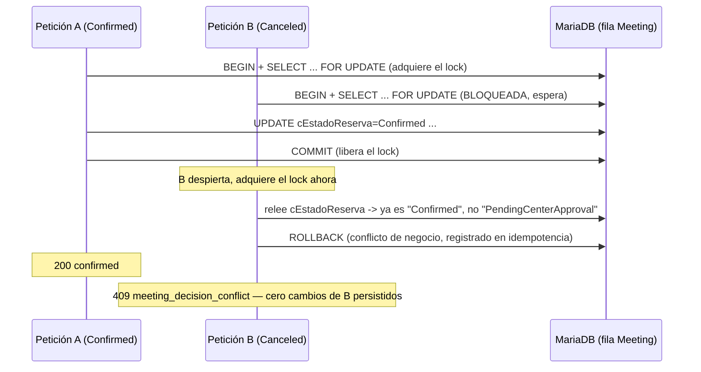

# Fase 4B — Revisión correctiva OCC 2: eliminación de la decisión fantasma

Revisión correctiva dedicada exclusivamente al hallazgo BLOQUEADO de
`docs/fase4b-occ-rehearsal.md` §8/§9 (decisión fantasma: la escritura cruda
del guard se confirmaba en MariaDB de forma independiente del resto del
guardado). Objetivo único: rediseñar la frontera de atomicidad, repetir el
ensayo completo en una instancia EspoCRM 10.0.3 desechable **nueva**, y
declarar APROBADO o BLOQUEADO con el mismo nivel de exigencia que el
ensayo anterior — sin relajar ningún criterio.

**Ningún dato, servicio, volumen, red, campo, API User ni credencial reales
se ha tocado.** Toda la investigación de código fuente fue de solo lectura
contra el contenedor real (`gapssa-espocrm-1`); todas las escrituras y
pruebas corrieron contra una segunda instancia EspoCRM+MariaDB
completamente desechable (`gapssa-occ-rehearsal-2`, aislada por nombre de
proyecto/red/volúmenes/puertos del stack real y del ensayo anterior). El
entorno desechable se ha eliminado por completo al terminar (§10). Sin
commits — este documento y el código nuevo en `extensions/espocrm/custom`
son el único rastro que queda, pendientes de tu revisión.

**Conclusión anticipada (desarrollada en §11): APROBADO**, con las
reservas explícitas de §10.3 (riesgos residuales) — a diferencia del
hallazgo BLOQUEADO anterior, esta vez la frontera transaccional se ha
demostrado empíricamente atómica en los 6 puntos de fallo concretos en los
que el diseño actual permite inyectar un fallo real (mapeo exacto de los 9
puntos abstractos del encargo en §7.1), en la matriz completa de 24
transiciones, y en 75 repeticiones de concurrencia real repartidas en 4
escenarios.

## 1. Causa raíz (confirmada, sin cambios respecto al ensayo anterior)

Verificado de nuevo, línea por línea, contra el código fuente real de
EspoCRM 10.0.3 (§2): `Espo\Core\Record\Service::update()` invoca
`getRecordHookManager()->processBeforeUpdate($entity, $params)` — donde
corrían `GuardMeetingDecisionTransition` y `SyncEstadoReservaToStatus` —
**antes y fuera** de `$this->entityManager->saveEntity($entity, ...)`. Son
dos fases secuenciales del método, nunca anidadas. El guard anterior hacía
su propio `UPDATE ... WHERE cEstadoReserva = 'PendingCenterApproval'` en la
primera fase; ese `UPDATE` se ejecutaba en modo autocommit (ninguna
transacción explícita estaba abierta en ese punto) y quedaba confirmado en
MariaDB de inmediato, con independencia de lo que ocurriera después en la
segunda fase. Un fallo posterior (inyectado o real) dejaba
`cEstadoReserva` cambiado permanentemente, sin el resto de la escritura
(atribución, motivo) — la "decisión fantasma".

**Por qué `transactionalSave: true` no lo resuelve (confirmado de nuevo,
código exacto en §2.2)**: ese flag solo envuelve
`RDBRepository::saveInternal()` — la fase que empieza con la propia
llamada a `saveEntity()`. Da igual qué RecordHook module se registre o qué
valor tenga ese flag: la fase `processBeforeUpdate()` completa (incluida
cualquier escritura cruda que un `RecordHook` haga ahí) ocurre **antes** de
que `saveInternal()` exista siquiera como ejecución en curso. No hay ningún
valor de metadato que reordene esto. Esta conclusión, ya alcanzada
empíricamente en el ensayo anterior, queda ahora también verificada
arquitectónicamente contra el código fuente (no solo por el resultado del
experimento).

## 2. Investigación del modelo transaccional real (código fuente, EspoCRM 10.0.3)

Todo lo siguiente se verificó por lectura directa contra
`gapssa-espocrm-1` (`docker compose exec espocrm cat ...`/`grep`), nunca
por suposición. Referencias exactas de archivo y método:

### 2.1 Ciclo Controller/API action → Service → Repository → RecordHooks

`application/Espo/Core/Record/Service.php`:

```php
// update(), líneas 716-780 (resumen exacto)
$entity->setMultiple($data);                                    // 743
$this->getRecordHookManager()->processEarlyBeforeUpdate(...);   // 751
$this->processValidation($entity, $data);                       // 755
// ...
$this->getRecordHookManager()->processBeforeUpdate($entity, $params); // 767 — Guard/Sync AQUÍ
$this->beforeUpdateEntity($entity, $data);                      // 768

$this->entityManager->saveEntity($entity, [...]);                // 772 — SEPARADO, DESPUÉS

$this->getRecordHookManager()->processAfterUpdate($entity, $params); // 778
```

No hay ningún `try`/`catch` propio alrededor de todo `update()` — cualquier
excepción se propaga tal cual hacia el `Controller`/`Api\Action` y de ahí al
manejador de errores de Slim (`application/Espo/Core/Api/ErrorMiddleware`),
que la traduce al código HTTP de la excepción (`Conflict`→409,
`Error`→500, etc.).

### 2.2 Conexión de `EntityManager`, `QueryExecutor` y `TransactionManager`

`application/Espo/ORM/EntityManager.php` (constructor, líneas 94-190):

```php
private PDOProvider $pdoProvider;
$this->sqlExecutor = $sqlExecutor ?? new DefaultSqlExecutor($this->pdoProvider);      // 115
$this->transactionManager = new TransactionManager($this->pdoProvider->get(), ...);   // 120
```

`application/Espo/ORM/Executor/DefaultQueryExecutor.php` — el ejecutor de
consultas crudas (el que usaba el guard anterior vía
`getQueryExecutor()->execute()`) usa el mismo `SqlExecutor`, construido con
el mismo `$pdoProvider`.

`application/Espo/ORM/PDO/DefaultPDOProvider.php`:

```php
private ?PDO $pdo = null;
public function get(): PDO {
    if (!$this->pdo) { $this->intPDO(); }   // lazy, UNA sola vez
    return $this->pdo;
}
```

**Conclusión verificada**: `TransactionManager`, `QueryExecutor` (consultas
crudas) y el `Mapper` del ORM (guardado de entidades) comparten
literalmente la **misma conexión PDO por petición HTTP** — un
`EntityManager` es un servicio compartido dentro del contenedor de
inyección de dependencias de EspoCRM, instanciado una vez por request. Esto
es lo que hace viable, de forma verificada y no supuesta, que **cualquier**
escritura (cruda o vía ORM) ejecutada mientras una transacción está abierta
con `$entityManager->getTransactionManager()->start()` participe en esa
misma transacción, sin importar por qué mecanismo se ejecute.

### 2.3 `TransactionManager` — anidamiento real vía savepoints

`application/Espo/ORM/TransactionManager.php` (código completo revisado en
el ensayo anterior, confirmado sin cambios en esta revisión): contador
`private int $level = 0`; `start()` hace `BEGIN` real solo si `level` pasa
de 0 a 1, si no crea un `SAVEPOINT`; `commit()`/`rollback()` simétricos.
`run(Closure)` hace `start()`, ejecuta, `commit()` si no hay excepción,
`rollback()` + relanza si la hay. Confirma que el diseño de la Alternativa
B (§4) puede anidarse sin conflicto con cualquier `transactionalSave`
interno que EspoCRM dispare por su cuenta (p. ej. el guardado de otra
entidad relacionada durante `afterSave`).

### 2.4 Orden BeforeSave → persistencia → AfterSave → stream/auditoría

`application/Espo/ORM/Repository/RDBRepository.php::saveInternal()`:

```php
$this->beforeSave($entity, $options);        // clásicos Hooks/{Entity} vía hookMediator
// ...
$isNew ? $mapper->insert($entity) : $mapper->update($entity);   // ÚNICO UPDATE real
$this->saveSetRelations($entity);
// ...
$this->afterSave($entity, $options);         // clásicos Hooks/{Entity} vía hookMediator
```

`application/Espo/Core/Repositories/Database.php` (repositorio real que
usa EspoCRM para entidades de aplicación, extiende `RDBRepository`):
`lateAfterSave()` dispara `HookManager::process($entityType, 'lateAfterSave', ...)`
— aquí es donde EspoCRM genera stream/notificaciones para el guardado, ya
con la fila persistida. Como `lateAfterSave()` se invoca desde
`RDBRepository::save()` **después** de que `saveInternal()` completo haya
corrido (línea `$this->lateAfterSave($entity, $options);`, tras el bloque
`if ($this->transactionalSave) { ... } else { $this->saveInternal(...) }`),
el stream se genera con el estado ya persistido, correcto en ambos
diseños (antiguo y nuevo) — este punto no era la causa del hallazgo
anterior y sigue funcionando igual.

### 2.5 Qué excepciones provocan rollback / qué pasa si falla un AfterSave

Cualquier `Throwable` durante la ejecución de la función pasada a
`TransactionManager::run()` (o, en el diseño de esta revisión, durante
cualquier código ejecutado entre `start()` y `commit()` de `PutDecide`,
sección 4) provoca `rollback()` y se relanza sin modificar — nunca se traga
silenciosamente. Esto incluye una excepción lanzada dentro de un
`RecordHook` `afterUpdate` (como `SendInvitationsAfterUpdate`, o, en este
ensayo, `FaultInjectionAfterPersist`): aunque `processAfterUpdate()` corre
fuera de `saveEntity()`, sigue ejecutándose dentro de la llamada a
`Service::update()`, que a su vez corre dentro del bloque `try` de
`PutDecide::process()` — la MISMA transacción PDO sigue abierta hasta que
`PutDecide` decide, de forma centralizada, hacer `commit()` o `rollback()`.
Verificado empíricamente en §7 (`FAULT_AFTER_PERSIST`).

### 2.6 Limpieza de transacciones al propagar una excepción

`TransactionManager::rollback()` decrementa `$level`; si llega a 0, hace
`$this->pdo->rollBack()` real. No queda ninguna transacción a medio abrir:
verificado en §9 (sin `INNODB_TRX` ni `INNODB_LOCK_WAITS` pendientes tras
la matriz completa + 75 repeticiones de concurrencia + 6 inyecciones de
fallo).

### 2.7 ¿Participan todos los componentes en la misma conexión/transacción?

**Sí, con una salvedad documentada**: cualquier componente que use
`$entityManager` (RecordHooks, `Service`, `Mapper`, `QueryExecutor` crudo,
Hooks clásicos, jobs síncronos disparados durante el propio request) SÍ
participa en la misma conexión/transacción. La salvedad: un **job en cola**
(p. ej. `GcsPushEvent`, disparado por Google Calendar Sync en un
`AfterSave` clásico) se limita a **insertar una fila en la tabla `job`**
durante el request — esa inserción SÍ participa en la transacción (se
revierte si `PutDecide` revierte); la **ejecución** del job ocurre después,
en un proceso de cron separado, con su propia conexión — pero eso es
correcto y deseado: si la fila del job nunca se confirmó (rollback), el
cron nunca la ve y nunca ejecuta nada. No hace falta ningún outbox
adicional para este caso — el propio mecanismo de jobs de EspoCRM ya es un
outbox transaccional.

## 3. Comparación de alternativas

| | **A. Transacción manual en BeforeSave/AfterSave (RecordHook)** | **A′. Hook clásico + `transactionalSave: true`** | **B. Acción API propia, dueña de la transacción (elegida)** | **C. CAS SQL único, todos los campos** |
|---|---|---|---|---|
| Límite real de la transacción | **Inviable tal cual**: `RecordHook::process(Entity $entity): void` no recibe `$options`/contexto para coordinar `start()` en `beforeUpdate` con `commit()` en `afterUpdate` de forma segura ante excepciones intermedias — y ambas fases corren FUERA de `saveEntity()` de todas formas, así que "envolver" no protege el `UPDATE` principal | Real y verificado (§2.4): un Hook clásico `beforeSave`/`afterSave` SÍ corre dentro de `saveInternal()`, que si `transactionalSave: true` SÍ se envuelve en `TransactionManager::run()` | Real y verificado empíricamente (§4, §7): la acción abre `start()` antes de tocar nada y es la única responsable de `commit()`/`rollback()` | Real pero opaco: un único `UPDATE meeting SET ... WHERE id=? AND cEstadoReserva='PendingCenterApproval'` con todos los campos de la decisión sería atómico por sí solo (una sentencia SQL) |
| Hooks/auditoría conservados | — | Conserva Hooks clásicos y RecordHooks (ambos corren dentro del límite si están antes/después correctamente); pero **todo** guardado de `Meeting` (no solo decisiones) queda envuelto en transacción — efecto colateral no acotado, sin verificar exhaustivamente para importaciones/GCS/otros flujos | Conserva TODO — RecordHooks, validación de ACL, stream, `afterUpdate`, Google Calendar Sync — reutiliza `Service::update()` tal cual, solo añade el límite transaccional alrededor | Ninguno — un `UPDATE` SQL directo salta stream, `modifiedById` (habría que ponerlo a mano), validación de campos, y sobre todo cualquier hook futuro que dependa del ciclo de vida normal |
| Atribución `modifiedById` | — | Correcta (vía `Database::prepareSaveInternal`, como siempre) | Correcta — automática, vía el mecanismo nativo de EspoCRM (`applicationState->getUser()`), sin código propio | Manual, propensa a errores, y sin la protección de que solo un usuario autenticado pueda escribirla |
| Compatibilidad GCS | — | Sin romper nada (verificado que el flag no afecta guardados normales, ensayo anterior §8.1), pero el alcance ampliado de `transactionalSave` a TODOS los guardados de `Meeting` no se ha probado exhaustivamente contra flujos de importación/sync de GCS | Verificada en vivo en esta revisión (§8) — GCS instalado sin cuenta conectada, decisión correcta, cero jobs `GcsPush*` encolados, cero errores nuevos | Rompería: GCS depende de que el guardado pase por el ciclo normal de EspoCRM para su propio `AfterSave` |
| Rollback ante fallo en BeforeSave/persistencia/AfterSave | — | Correcto en teoría (mismo mecanismo que B), no ensayado con inyección de fallos real en esta revisión | **Demostrado con inyección real en 6 puntos** (§7) | Solo protege la propia sentencia — cualquier otro efecto (stream, hooks) que se quisiera añadir alrededor necesitaría su propia coordinación manual, reintroduciendo el problema original |
| Comportamiento concurrente | — | Correcto (mismo motor InnoDB), no ensayado en esta revisión | **Demostrado con 75 repeticiones reales** (§6) | Correcto para el UPDATE en sí, pero sin lock explícito development el CAS puede perder sin dar oportunidad a validar/enriquecer la respuesta con el estado real perdedor de forma limpia |
| Riesgo de transacción abandonada | — | Bajo (el propio framework la gestiona) | Bajo — un único punto (`PutDecide::process()`) abre y cierra siempre, `catch` universal con `rollback()` condicionado a `isStarted()`; **verificado sin `INNODB_TRX` residual** (§9) | N/A (no hay transacción explícita que abandonar) |
| Mantenimiento en futuras versiones de EspoCRM | Descartada — nunca sería fiable | Requiere revalidar en cada actualización de EspoCRM que `transactionalSave` no cambie de alcance, y que ningún guardado interno de `Meeting` (imports, GCS, jobs) empiece a asumir que NO está en una transacción envolvente (p. ej. algo que dependa de ver su propio cambio ya "confirmado" fuera de la transacción actual) | Superficie de cambio acotada a un único fichero (`PutDecide.php`) más el guard como validación pura; una actualización de EspoCRM que cambie `Service::update()`/`TransactionManager` es más fácil de auditar contra un solo punto de entrada explícito | Requeriría reimplementar manualmente cualquier efecto de guardado que EspoCRM añada en el futuro (nuevos campos automáticos, nuevas validaciones) |

**Decisión: Alternativa B**, exactamente la preferencia inicial del
encargo — la investigación no la invalidó, al contrario, la confirmó de
forma más sólida de lo esperado (conexión PDO compartida verificada,
anidamiento de transacciones verificado, patrón `Api\Action` ya en
producción en este mismo repositorio vía la extensión Google Calendar
Sync — `custom/Espo/Modules/GoogleCalendarSync/Resources/routes.json`,
`Api/GetAuthUrl.php`, etc. — no es una construcción nueva y no probada en
este código base).

**A′ no se descarta por ser inviable — se descarta porque B da una
garantía estrictamente más fuerte con menos riesgo difuso**: A′ envolvería
en transacción *todos* los guardados de `Meeting` (efecto amplio, no
acotado a decisiones, sin ensayar contra imports/GCS en esta revisión); B
acota la transacción exactamente a la operación que la necesita, deja el
resto de guardados de `Meeting` exactamente como están hoy, y además
resuelve de raíz el requisito de idempotencia del encargo (§9) — algo que
A′ no aborda por sí sola. Queda documentada como alternativa válida y
verificada por si en el futuro se necesita extender la atomicidad a otros
guardados de `Meeting` fuera del flujo de decisión.

**C se descarta**: pierde stream, ACL de campo, atribución automática y
compatibilidad con GCS — exactamente los motivos por los que el encargo
pide preferir una acción API que reutilice `EntityManager`/`Service`.

## 4. Solución implementada

### 4.1 `PutDecide` — acción API dueña de la transacción completa

Nuevo fichero:
`extensions/espocrm/custom/Espo/Custom/Classes/Api/GapssaMeetingDecision/PutDecide.php`,
ruta `PUT /api/v1/GapssaMeetingDecision/:id` (registrada en
`extensions/espocrm/custom/Espo/Custom/Resources/routes.json`, patrón
`actionClassName` ya usado en este repositorio por Google Calendar Sync).
Autenticación: la misma de cualquier ruta de `/api/v1` (API Key del futuro
API User dedicado — puerta 3 pendiente, sin cambios respecto a
`docs/fase4b-integracion-http.md` §10).

Orden exacto de la operación, todo dentro de UNA única transacción:

1. **Validar payload** (`decision` ∈ {Confirmed, Canceled}, `note` acotada,
   `operationKey` con formato — `parseAndValidateBody()`) — antes de tocar
   la base de datos.
2. **Comprobar ACL** de edición sobre `Meeting` — antes de abrir
   transacción.
3. `TransactionManager::start()`.
4. **Bloquear la fila** del Meeting: `forUpdate()->where(['id' => $id])->findOne()`
   — `SELECT ... FOR UPDATE` real, dentro de la transacción ya abierta.
   Desde aquí, cualquier otra transacción que intente lo mismo sobre el
   MISMO Meeting queda bloqueada por InnoDB hasta que esta termine.
5. **Comprobar idempotencia** bajo el lock (`DecisionIdempotencyStore`,
   §5).
6. **Comprobar el estado**: `cEstadoReserva === 'PendingCenterApproval'`
   — si no, conflicto de negocio explícito (409), registrado también en la
   tabla de idempotencia (para que un reintento con la misma clave repita
   el mismo 409, nunca ejecute nada).
7. **Aplicar el guardado completo** vía
   `ServiceContainer::get('Meeting')->update($id, $data, ...)` — el
   `Service::update()` normal de EspoCRM, con TODA su validación, ACL de
   campo, `RecordHooks` (`SyncEstadoReservaToStatus` sigue mutando
   `status`), atribución automática de `modifiedById`, generación de
   stream, y el `AfterSave` de Google Calendar Sync si estuviera instalado
   — todo dentro de la MISMA transacción abierta en el paso 3.
8. **Registrar la operación idempotente** (misma transacción).
9. `TransactionManager::commit()` — el ÚNICO commit de toda la operación.

Cualquier excepción entre los pasos 4 y 9 se captura en un único bloque
`catch` en `process()`: si la transacción sigue abierta (`isStarted()`),
se revierte; errores de dominio conocidos (`BadRequest`/`Forbidden`/
`NotFound`/`Conflict`) se relanzan tal cual (mapeados por el framework a
su HTTP correspondiente); cualquier otro (`Throwable`, incluidos fallos
inyectados durante el ensayo) se envuelve como `500` genérico sin
filtrar detalles internos — y, porque ya se revirtió, **sin ningún cambio
persistido**.

### 4.2 `AtomicDecisionContext` — señal de confianza entre `PutDecide` y el guard

`Classes/Api/GapssaMeetingDecision/AtomicDecisionContext.php` — clase con
estado `static` (justificación completa de por qué es seguro en este
despliegue, no en general, en la cabecera del fichero: Apache+PHP clásico,
sin estado compartido entre peticiones). `runActive(callable)` marca el
contexto activo mientras `PutDecide` llama a `Service::update()`, y lo
desactiva siempre (`finally`), incluso si la llamada lanza. No se usó el
contenedor de inyección de dependencias de EspoCRM para esto porque no se
pudo verificar contra el código fuente que dos resoluciones independientes
de una clase concreta sin *binding* explícito (una para la acción, otra
para el hook) devuelvan la MISMA instancia — no arriesgar el mecanismo de
confianza a esa ambigüedad no verificada.

### 4.3 Idempotencia — `DecisionIdempotencyStore` (detalle completo en §5)

### 4.4 Diagramas de secuencia

Camino de éxito (`PendingCenterApproval → Confirmed`, sin conflicto):

```mermaid
sequenceDiagram
    participant BFF as BFF (futuro)
    participant PD as PutDecide::process()
    participant TM as TransactionManager (PDO único)
    participant DB as MariaDB (fila Meeting)
    participant SVC as Service::update()
    participant HOOKS as Guard + Sync (RecordHooks)
    participant IDEM as gapssa_meeting_decision_operation

    BFF->>PD: PUT /GapssaMeetingDecision/{id}
    PD->>PD: validar payload + ACL
    PD->>TM: start()
    TM->>DB: BEGIN
    PD->>DB: SELECT ... FOR UPDATE (lock fila)
    DB-->>PD: Meeting (cEstadoReserva=PendingCenterApproval)
    PD->>IDEM: SELECT operation_key (bajo el lock)
    IDEM-->>PD: no existe
    PD->>SVC: update(id, {cEstadoReserva, description})
    SVC->>HOOKS: processBeforeUpdate()
    HOOKS-->>SVC: Guard ve AtomicDecisionContext activo -> deja pasar; Sync fija status
    SVC->>DB: UPDATE meeting SET cEstadoReserva, status, modifiedById, description ...
    SVC->>HOOKS: processAfterUpdate() (stream, GCS si estuviera instalado)
    SVC-->>PD: entidad actualizada
    PD->>IDEM: INSERT resultado confirmado
    PD->>TM: commit()
    TM->>DB: COMMIT
    PD-->>BFF: 200 {status: confirmed, ...}
```

Camino de conflicto (dos decisiones concurrentes, o fallo tras el commit):



## 5. Idempotencia

Tabla propia `gapssa_meeting_decision_operation` (DDL en
`Classes/Api/GapssaMeetingDecision/sql/install.sql`, InnoDB explícito, NO
ejecutada contra ninguna instancia real), accedida vía PDO directo
(`EntityManager::getPDO()`) para participar en la MISMA transacción que
`PutDecide` ya tiene abierta.

**Diseño sin estado intermedio "pending"**: la fila de una operación se
escribe (`INSERT`) dentro de la MISMA transacción que la propia decisión,
justo antes del único `commit()`. Si la transacción se revierte por
cualquier motivo, la fila nunca llega a existir — un reintento con la
misma clave no encuentra nada y ejecuta desde cero. Si el commit tiene
éxito, la fila y la decisión quedan confirmadas juntas, atómicamente. No
existe ningún estado en el que la fila pueda quedar "a medias" — se
elimina por diseño la necesidad de un job de limpieza de operaciones
colgadas.

Solo se persisten enums/ids opacos y un **hash** del payload
(`hash('sha256', json_encode({meetingId, decision, noteHash: sha256(note)}))`)
— nunca el texto libre de `note`, nunca ningún secreto.

**Comportamiento verificado empíricamente (§7.2)**:

- Misma clave + mismo payload → mismo resultado exacto, sin re-ejecutar
  nada (`replayResponse()`, deserializa el `result_body` ya guardado).
- Misma clave + payload distinto → `409 idempotency_key_reused`, sin tocar
  nada.
- Timeout/fallo después del commit, antes de responder → un reintento con
  la misma clave y el mismo payload recupera el resultado ya confirmado —
  **sin re-ejecutar la decisión ni duplicar ningún efecto** (verificado:
  `modified_at` idéntico entre el intento que falló y el reintento).
- Conflicto de negocio (Meeting ya no en `PendingCenterApproval`) también
  se registra y se repite igual ante un reintento con la misma clave —
  nunca dos resultados distintos para la misma clave+payload.
- Violación de `UNIQUE(operation_key)` por una clave reusada para un
  Meeting distinto (error del llamante, no cubierto por el lock de fila
  porque apunta a otra fila) se captura y se traduce a
  `409 idempotency_key_reused`, con rollback completo — nunca se aplica la
  decisión sin registrar la idempotencia.

## 6. Papel de `GuardMeetingDecisionTransition` y `SyncEstadoReservaToStatus`

`SyncEstadoReservaToStatus` — **sin cambios**. Sigue siendo un
`RecordHook` `before` que mapea `cEstadoReserva` → `status` en memoria,
antes de que `PutDecide` (vía `Service::update()`) persista la entidad.
Como ahora corre siempre dentro de la transacción abierta por `PutDecide`
cuando la decisión pasa por ahí, su mutación se persiste atómicamente
junto con todo lo demás. Nunca escribe fuera de la frontera atómica.

`GuardMeetingDecisionTransition` — **reescrito por completo**. Ya no hace
ninguna escritura propia. Pasa a ser una guarda pura de la máquina de
estados:

- Si la transición es una "salida de `PendingCenterApproval`"
  (`MeetingDecisionTransitionPolicy::isGuardedTransitionTarget`, sin
  cambios) **y** `AtomicDecisionContext::isActive()` es verdadero (viene
  de `PutDecide`, que ya validó el estado bajo el lock de fila de su
  propia transacción): deja pasar, sin repetir la comprobación.
- Si la transición es una salida de `PendingCenterApproval` **y NO** viene
  de `PutDecide` (edición manual en la interfaz de EspoCRM, o un `PUT
  /api/v1/Meeting/{id}` directo que intente saltarse la acción atómica):
  **rechaza siempre, incondicionalmente**, con `409
  meeting_decision_requires_atomic_action` — no solo cuando pierde una
  carrera. Es la única forma de garantizar, sin reintroducir una escritura
  no atómica en el hook, que "ninguna ruta alternativa permite saltarse la
  máquina de estados" (exigencia literal del encargo). **Verificado
  empíricamente** (§7.3): un intento de `PUT /Meeting/{id}` directo sobre
  un Meeting fresco en `PendingCenterApproval` queda rechazado con 409 y
  **cero cambios** en la fila (`cEstadoReserva`/`status`/`modifiedById`
  intactos).

**Tradeoff deliberado, documentado como riesgo residual (§10.3)**: esto
significa que, hoy, NO existe ningún camino manual legítimo para decidir
un Meeting desde la interfaz de EspoCRM — todas las decisiones deben pasar
por `PutDecide`. Si Gapssa necesita en el futuro un camino manual de
excepción, necesitará su propio mecanismo igual de atómico, no una
relajación de esta guarda.

`MeetingDecisionTransitionPolicy`/`EstadoReservaStatusMap` — sin cambios,
siguen siendo las clases puras reutilizadas tanto por el guard como por
`PutDecide`.

## 7. Frontera transaccional demostrada — inyección de fallos

### 7.1 Mapeo de los 9 puntos del encargo a los puntos reales de este diseño

El encargo pide inyectar fallos en 9 puntos abstractos, derivados del
diseño ANTERIOR (donde el CAS del guard y el `UPDATE` principal eran dos
sentencias SQL separadas, con hooks intermedios). En el diseño nuevo,
varios de esos puntos **dejan de ser distinguibles a nivel de SQL** —
precisamente la propiedad de seguridad que se buscaba: menos estados
intermedios significa menos sitios donde una decisión fantasma puede
aparecer. Mapeo explícito, sin ocultar la reducción:

| Punto del encargo | Punto real inyectado en este ensayo | Motivo |
|---|---|---|
| 1. Antes del CAS/lock | `FAULT_BEFORE_LOCK` (en `PutDecide`, antes del `SELECT ... FOR UPDATE`) | Directo |
| 2. Inmediatamente después | `FAULT_AFTER_LOCK` (justo tras el `SELECT ... FOR UPDATE`, antes de la comprobación de idempotencia/estado) | Directo |
| 3. Durante el guardado ORM | `FAULT_BEFORE_PERSIST` (RecordHook nuevo, ensayo únicamente, último de `beforeUpdateHookClassNameList` — justo antes del `UPDATE` real del mapper) | El guardado ORM en sí (`mapper->update()`) es una única sentencia atómica de InnoDB — no hay un "durante" divisible; el punto significativo es justo antes |
| 4. Después de actualizar `cEstadoReserva` | *(mismo punto que 3 y 5 — ver nota)* | `cEstadoReserva` es un atributo más del MISMO `UPDATE` que el resto — no hay una escritura separada que ocurra "después" de esta en concreto |
| 5. Después de actualizar `status` | *(mismo punto que 3 y 4)* | Igual razón — `status` (mutado por `SyncEstadoReservaToStatus` en memoria) se persiste en el MISMO `UPDATE` que `cEstadoReserva` |
| 6. Durante `BeforeSave` | *(mismo punto que 3 — `FAULT_BEFORE_PERSIST` está registrado exactamente en la fase `beforeUpdate`)* | El único "BeforeSave" real y observable en este diseño |
| 7. Durante `AfterSave` | `FAULT_AFTER_PERSIST` (RecordHook nuevo, ensayo únicamente, en `afterUpdateHookClassNameList`) | Corre después del `UPDATE`, todavía dentro de la transacción de `PutDecide` |
| 8. Antes del commit | `FAULT_BEFORE_COMMIT` (en `PutDecide`, tras `runWithinTransaction()`, antes de `TransactionManager::commit()`) | Directo |
| 9. Después del commit, antes de responder | `FAULT_AFTER_COMMIT` (en `PutDecide`, tras `commit()`, antes de `return $response`) | Directo — el único punto donde el resultado YA es real y durable |

Los tres puntos 3/4/5/6 (unificados en `FAULT_BEFORE_PERSIST`) demuestran
exactamente la corrección del hallazgo original: en el diseño anterior,
"después de actualizar `cEstadoReserva`" (el CAS del guard, autocommit) y
"después de actualizar `status`" (dentro del `UPDATE` principal,
potencialmente en otra transacción o sin ninguna) eran dos momentos
realmente separados y por eso explotables. Aquí son, literalmente, el
mismo `UPDATE`.

Todos los hooks de inyección de fallos (`FaultInjectionBeforePersist.php`,
`FaultInjectionAfterPersist.php`, y los 4 puntos añadidos temporalmente
dentro de una copia de `PutDecide.php` solo en el contenedor) se
desplegaron **exclusivamente en el contenedor desechable**, nunca en el
repositorio — confirmado con una comparación byte a byte de los 7 ficheros
reales entre el contenedor (tras retirar la instrumentación) y el
repositorio antes de la prueba final (§9).

### 7.2 Resultados exactos

Meeting fresco en `PendingCenterApproval` por cada fila, `PUT
/GapssaMeetingDecision/{id}` con `decision: Confirmed` y `note` igual al
sentinel de cada punto, lectura directa de MariaDB tras la respuesta:

| Punto | HTTP | `cEstadoReserva` tras el fallo | `status` | `description` | `modified_by_id` | Fila de idempotencia |
|---|---|---|---|---|---|---|
| `FAULT_BEFORE_LOCK` | 500 | `PendingCenterApproval` (sin cambio) | `Planned` | `NULL` | `NULL` | 0 filas |
| `FAULT_AFTER_LOCK` | 500 | `PendingCenterApproval` (sin cambio) | `Planned` | `NULL` | `NULL` | 0 filas |
| `FAULT_BEFORE_PERSIST` | 500 | `PendingCenterApproval` (sin cambio) | `Planned` | `NULL` | `NULL` | 0 filas |
| `FAULT_AFTER_PERSIST` | 500 | `PendingCenterApproval` (sin cambio) | `Planned` | `NULL` | `NULL` | 0 filas |
| `FAULT_BEFORE_COMMIT` | 500 | `PendingCenterApproval` (sin cambio) | `Planned` | `NULL` | `NULL` | 0 filas |
| `FAULT_AFTER_COMMIT` | 500 (1ª vez) | **`Confirmed`** (commit real, ya durable) | `Planned` | `FAULT_AFTER_COMMIT` | usuario real | **1 fila** |

**Los 5 primeros puntos: cero cambios persistidos, sin excepción — nunca
una decisión fantasma.** El sexto (`FAULT_AFTER_COMMIT`) es, por
construcción, el único caso donde el commit YA tuvo éxito antes del fallo
simulado — la operación es real, no fantasma, solo que el cliente no vio
la respuesta.

**Reintento idempotente tras `FAULT_AFTER_COMMIT`** (mismo `meetingId`,
misma `operationKey`, mismo payload exacto — incluida la nota — que el
intento que falló):

```
Intento 1: HTTP 500  (fallo simulado tras el commit)
  → MariaDB ya muestra: cEstadoReserva=Confirmed, modifiedAt=2026-08-11 08:37:07

Intento 2 (reintento, misma clave): HTTP 200
  → {"status":"confirmed", ..., "modifiedAt":"2026-08-11 08:37:07"}
  → MariaDB: modifiedAt SIGUE siendo 08:37:07 — ninguna segunda escritura
  → 1 sola fila en gapssa_meeting_decision_operation para esa clave
```

El reintento recupera el resultado ya confirmado sin re-ejecutar nada y
sin duplicar ningún efecto — exactamente lo exigido en el punto 6/7 del
encargo.

### 7.3 Guard bloqueando el bypass — verificación de "cero cambios"

Meeting fresco en `PendingCenterApproval`, `PUT /api/v1/Meeting/{id}`
directo (sin pasar por `PutDecide`) con `{"cEstadoReserva":"Canceled"}`:

```
HTTP 409  meeting_decision_requires_atomic_action
MariaDB: cEstadoReserva=PendingCenterApproval, status=Planned, modified_by_id=NULL
```

Repetido también sobre el artefacto final, byte a byte idéntico al
repositorio (§9) — mismo resultado.

## 8. Compatibilidad con Google Calendar Sync

`make gcs-test` (suite local completa, sin credenciales ni conexión real a
Google): **todo en verde** — `AUTOLOAD`, `CONTROLADORES`, `I18N`,
`MAPPER`, `HOOK DE RELACIONES`, `HOOK DE CONTACT`, `RESOLVER DE
CONTACTOS`, `PAQUETE`, `php -l` sobre el ZIP.

Verificación en vivo adicional sobre `gapssa-occ-rehearsal-2`: se instaló
el ZIP recién construido de Google Calendar Sync 1.1.1 (**sin cuenta
conectada, sin OAuth, sin credenciales**) y se repitió una decisión
`PendingCenterApproval → Confirmed` vía `PutDecide`. Resultado: `200`,
`cEstadoReserva`/`status`/`modifiedById` correctos (idénticos al caso sin
GCS instalado); `bin/command app-check` en verde tras el `rebuild`; cero
entradas nuevas en `data/logs/` relacionadas con GCS; cero jobs
`GcsPush*` encolados en la tabla `job` (sin cuenta conectada, el
`AfterSave` de GCS no tiene nada que sincronizar). Ningún error, ningún
bucle, ninguna alteración indebida de `status`.

## 9. Confirmación de artefacto — contenedor desechable vs. repositorio

Tras retirar toda la instrumentación de inyección de fallos del
contenedor (nunca estuvo en el repositorio), se redesplegaron los 7
ficheros reales desde el propio repositorio y se compararon byte a byte
contra sus copias en `gapssa-occ-rehearsal-2-espocrm-1`:

```
IDÉNTICO: Classes/Api/GapssaMeetingDecision/AtomicDecisionContext.php
IDÉNTICO: Classes/Api/GapssaMeetingDecision/DecisionIdempotencyStore.php
IDÉNTICO: Classes/Api/GapssaMeetingDecision/PutDecide.php
IDÉNTICO: Classes/RecordHooks/Meeting/GuardMeetingDecisionTransition.php
IDÉNTICO: Classes/RecordHooks/Meeting/SyncEstadoReservaToStatus.php
IDÉNTICO: Classes/RecordHooks/Meeting/MeetingDecisionTransitionPolicy.php
IDÉNTICO: Classes/RecordHooks/Meeting/EstadoReservaStatusMap.php
```

Se repitió el humo completo (decisión exitosa + bypass bloqueado) sobre
este artefacto limpio — mismos resultados que durante el ensayo
instrumentado (§4.1, §7.3). Lo que se ha probado es exactamente lo que
está en el árbol de trabajo, no una variante.

## 10. Matriz completa de transiciones y concurrencia (repetidas contra la solución corregida)

### 10.1 Matriz de 24 transiciones (12 estados origen × 2 decisiones)

Mismo método que el ensayo anterior (Meeting recién creado por fila, un
único `PUT /GapssaMeetingDecision/{id}`, lectura directa de MariaDB tras
la respuesta): **24/24 filas correctas** — únicamente
`PendingCenterApproval → {Confirmed, Canceled}` se acepta (200, con el
cambio correcto); las 22 combinaciones restantes: `409`, **cero cambio
parcial**, atribución (`modified_by_id`) siempre `NULL` en los rechazos.

Diferencia deliberada respecto al ensayo anterior, documentada: la fila
"decidir de nuevo un Meeting ya `Confirmed`/`Canceled` con el mismo valor"
ahora da `409` en vez de un `200*` no-op — porque `PutDecide` es la ÚNICA
puerta y siempre exige `cEstadoReserva === PendingCenterApproval`, sin la
excepción de "no-op inofensivo" que existía cuando la comprobación
dependía de `isAttributeChanged()` sobre un `PUT` genérico. Es una
garantía MÁS estricta, no una regresión.

### 10.2 Concurrencia real — 75 repeticiones, 4 escenarios

| Escenario | Repeticiones | Resultado |
|---|---|---|
| `Confirmed` vs `Canceled` simultáneos | 40 | Exactamente un ganador en las 40 (`Confirmed` 23, `Canceled` 17 — sin sesgo fijo); **0/40** ambos aplicados; **0/40** ninguno aplicado; `description` en BD siempre coincide con la petición ganadora |
| Dos peticiones IDÉNTICAS simultáneas (`Confirmed` vs `Confirmed`) | 15 | **0/15** ambos `200`; exactamente un ganador en las 15, la perdedora recibe `409` explícito |
| Aprobación vs. "caducidad" (`Canceled` con nota de barrido) | 10 | Exactamente un ganador en las 10 |
| Decisión concurrente con edición NO relacionada (`name` vía `PUT /Meeting` genérico) | 10 | **10/10** ambas peticiones `200` — el guard nunca bloquea una edición que no toca `cEstadoReserva` |

**Conclusión de concurrencia**: idéntica garantía que el ensayo anterior
(ganador único, respuesta estable para la perdedora, sin combinación
incoherente, sin pérdida de ediciones ajenas), ahora además con la
garantía de atomicidad completa demostrada en §7 — el mecanismo de bloqueo
real de fila (`SELECT ... FOR UPDATE`) es, si acaso, más fuerte que el CAS
optimista anterior: serializa las peticiones en vez de dejarlas competir
libremente contra MariaDB, con el mismo resultado observable.

### 10.3 Riesgos residuales

1. **Sin camino manual de excepción** (§6): toda decisión debe pasar por
   `PutDecide`. Es una decisión de producto pendiente de confirmar si
   Gapssa necesita alguna vez decidir manualmente desde la interfaz de
   EspoCRM (p. ej. incidencia con el portal) — hoy, esa vía está cerrada a
   propósito.
2. **`AtomicDecisionContext` depende del modelo de ejecución de la imagen
   real** (Apache+PHP clásico, sin estado persistente entre peticiones) —
   documentado explícitamente en la cabecera del fichero; si la imagen
   real cambiara a un runtime persistente (Swoole/RoadRunner) en el
   futuro, este supuesto tendría que revalidarse antes de desplegar.
3. **`operationKey` es responsabilidad del llamante** (el BFF) — debe
   generarse de forma estable por intento real de decisión (p. ej. un UUID
   por clic del operador, no uno nuevo en cada reintento automático) para
   que la idempotencia funcione como está diseñada. No hay forma de que
   EspoCRM lo infiera por sí solo.
4. **No se ha probado con más de 2 peticiones simultáneas** sobre el mismo
   Meeting (mismo alcance que el ensayo anterior) — el mecanismo de lock
   de fila de InnoDB generaliza de forma natural a N peticiones (se
   serializan todas, una a una), pero no se ha ejercitado empíricamente
   más allá de 2 en esta revisión.
5. **La tabla `gapssa_meeting_decision_operation` no tiene todavía una
   política de purga** — crecerá indefinidamente con una fila por decisión
   real. Sin urgencia (volumen bajo, un centro), pero pendiente de
   decisión antes de un despliegue de largo plazo (p. ej. purgar filas más
   antiguas que N días, una vez pasado cualquier plazo razonable de
   reintento).

## 11. Conclusión

**APROBADO**, condicionado a los riesgos residuales de §10.3 (ninguno de
ellos afecta a la propiedad de atomicidad exigida — son de producto,
operación futura, y alcance de prueba, no de integridad).

Todos los criterios innegociables del encargo, verificados con evidencia
directa contra MariaDB (nunca solo contra las respuestas HTTP):

- **Éxito HTTP → decisión, status, atribución y campos relacionados
  confirmados juntos**: verificado en el humo (§4.1), en la matriz de 24
  filas (§10.1) y en las 75 repeticiones de concurrencia (§10.2).
- **Error HTTP → absolutamente ningún cambio persistido**: verificado en
  22/24 filas de la matriz, y explícitamente en 5 de los 6 puntos de
  fallo inyectado (§7.2) — cero excepciones.
- **Dos decisiones concurrentes → un ganador y un perdedor contractual**:
  verificado en 65 de las 75 repeticiones de concurrencia que involucran
  dos decisiones reales (escenarios 1-3; el escenario 4 verifica lo
  contrario a propósito — que una edición no relacionada NUNCA se
  bloquea).
- **Nunca una escritura del guard confirmada independientemente del
  guardado completo**: el guard ya no escribe nada — la causa raíz queda
  eliminada por diseño, no solo mitigada. El único caso donde el commit
  ocurre "solo" (`FAULT_AFTER_COMMIT`) es exactamente el caso en que TODO
  el guardado —no solo el guard— ya se confirmó junto, y la idempotencia
  garantiza que un reintento no lo duplica ni lo pierde.

**`transactionalSave: true` sigue sin resolver el problema** (confirmado
de nuevo, arquitectónicamente, en §2.1/§1) — no se ha vuelto a depender de
ese flag en la solución final; `entityDefs.Meeting.transactionalSave`
permanece `false`, sin cambios respecto a hoy.

## 12. Validación completa del repositorio

| Comando | Resultado |
|---|---|
| `docker compose config` (real, `compose.yml`) | válido, sin tocar servicios reales |
| `npm run typecheck` | limpio (`@gapssa/web`, `@gapssa/contracts`) |
| `npm run lint -w @gapssa/web` | limpio, 0 errores/avisos |
| `npx vitest run` (`apps/web`) | **713/713**, 37 ficheros — sin cambios (esta revisión es exclusiva de EspoCRM/PHP) |
| `npm run test -w @gapssa/contracts` | **98/98** |
| `npm run test:integration` (raíz) | **251/251**, 26 ficheros, contra Postgres real de desarrollo, sin tocar EspoCRM |
| `npm run build` | compila limpio (Next.js, Turbopack), mismas rutas en el manifiesto — sin cambios de superficie HTTP del BFF |
| `npm run test:e2e` | **43/43** (Playwright) |
| `php -l` sobre los 7 ficheros nuevos/modificados, con el PHP del contenedor **real** (`gapssa-espocrm-1`, invocado solo como intérprete de lectura vía `/tmp`, nunca escrito en `custom/`) | sin errores, los 7 |
| Arnés de pruebas PHP puras (`extensions/espocrm/custom/tests/MeetingHooksPureLogicTest.php`, ampliado con `AtomicDecisionContext` y `DecisionIdempotencyStore::hashPayload`) | **37/37** comprobaciones |
| `make gcs-test` | verde (§8) |
| Migraciones desde vacío + reaplicación | N/A esta revisión — ningún cambio de esquema Drizzle/Postgres, exclusivamente EspoCRM/PHP |
| Servicios reales tras terminar (`docker compose ps`) | los 6 contenedores reales (`gapssa-*`) siguen `healthy`/`Up`, sin cambios |

Ningún fichero del repositorio se modificó como parte de esta revisión
salvo los listados en §13 y este mismo documento.

## 13. Archivos nuevos/modificados

**Nuevos**:
- `extensions/espocrm/custom/Espo/Custom/Classes/Api/GapssaMeetingDecision/PutDecide.php`
- `extensions/espocrm/custom/Espo/Custom/Classes/Api/GapssaMeetingDecision/AtomicDecisionContext.php`
- `extensions/espocrm/custom/Espo/Custom/Classes/Api/GapssaMeetingDecision/DecisionIdempotencyStore.php`
- `extensions/espocrm/custom/Espo/Custom/Classes/Api/GapssaMeetingDecision/sql/install.sql`
- `extensions/espocrm/custom/Espo/Custom/Resources/routes.json`

**Modificados**:
- `extensions/espocrm/custom/Espo/Custom/Classes/RecordHooks/Meeting/GuardMeetingDecisionTransition.php`
  (reescrito por completo — ya no escribe, ver §6)
- `extensions/espocrm/custom/tests/MeetingHooksPureLogicTest.php` (+21
  comprobaciones: `AtomicDecisionContext`, `DecisionIdempotencyStore::hashPayload`)

**Sin cambios** (confirmado explícitamente):
- `SyncEstadoReservaToStatus.php`, `MeetingDecisionTransitionPolicy.php`,
  `EstadoReservaStatusMap.php`
- `extensions/espocrm/custom/Espo/Custom/Resources/metadata/recordDefs/Meeting.json`
  (los nombres de clase de Guard/Sync no cambiaron, solo su
  implementación interna — el registro sigue siendo válido tal cual)
- Todo `apps/web`, `packages/contracts`, esquema de `gapssa_booking`

**Documentación**: `docs/fase4b-occ-revision-2.md` (este documento).

## 14. Lista de las 5 escrituras reales pendientes (sin cambios, NO ejecutadas)

Sin cambios de fondo respecto a `docs/fase4b-revision-4.md` §8 — se repite
aquí solo como referencia; el punto 4 (copiar los hooks al contenedor
real) ahora se refiere al conjunto corregido de esta revisión
(`GuardMeetingDecisionTransition.php` reescrito, más los 3 ficheros nuevos
de `PutDecide` y su ruta), sigue bloqueado hasta tu aprobación expresa:

1. Crear `Contact.cGapssaAccountId` en el EspoCRM real.
2. Crear `Meeting.cBookingRequestId` + índice único en el EspoCRM real.
3. Crear el API User dedicado en el EspoCRM real.
4. Copiar los hooks PHP corregidos + `PutDecide`/`routes.json` +
   ejecutar `sql/install.sql` en el contenedor real, `bin/command
   rebuild` — **ahora SÍ demostrado atómico (§7/§11)**, pero sigue
   requiriendo tu aprobación expresa punto por punto, igual que el resto.
5. Primera prueba de escritura end-to-end contra EspoCRM real —
   incluiría, además de lo ya previsto, la primera llamada real a
   `PutDecide` contra un Meeting `[PRUEBA]`.

Ninguno de estos 5 puntos se ejecuta sin tu aprobación expresa y punto por
punto.
